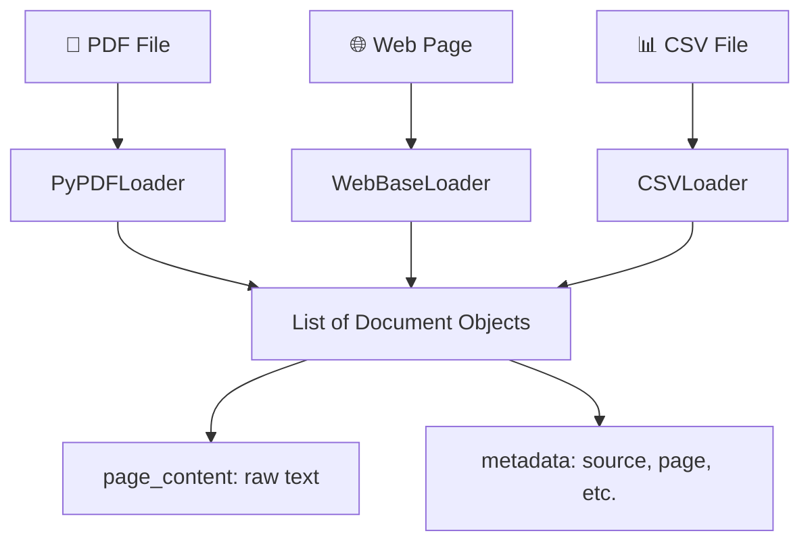

# 📥 Data Ingestion & Parsing

[Back to Master README](../README.md) | [Next: Chunking →](../02-chunking/README.md)

---

## Table of Contents

- [Topic Overview](#topic-overview)
- [Why It Matters in RAG](#why-it-matters-in-rag)
- [Mental Model](#mental-model)
- [Core Theory](#core-theory)
- [How It Works](#how-it-works)
- [The Document Format](#the-document-format)
- [Document Loaders in Practice](#document-loaders-in-practice)
- [Real-World Failure Modes](#real-world-failure-modes)
- [Common Mistakes](#common-mistakes)
- [Key Takeaways](#key-takeaways)
- [Checkpoint Questions](#checkpoint-questions)

---

## Topic Overview

**Data Ingestion & Parsing** is the very first step in any RAG pipeline. It is the process of extracting raw text from diverse data sources (PDFs, web pages, databases, CSVs) and standardizing them into a universal `Document` format that the rest of the pipeline can consume.

---

## Why It Matters in RAG

Large Language Models only understand **raw text strings**. But enterprise data lives in complex formats — PDFs with tables, HTML pages with navigation bars, scanned images. If this step fails, every downstream component (chunking, embedding, retrieval, generation) receives garbage.

> **Garbage In, Garbage Out.** The quality of your RAG system's output is fundamentally limited by the quality of your ingestion pipeline.


---

## Mental Model

Think of Data Ingestion as a **universal translator**:

- Input: Documents in dozens of different "languages" (PDF binary, HTML DOM, CSV rows)
- Output: A single, clean format that speaks one language — **plain text with metadata**

Without this translator, your RAG pipeline would need custom logic for every file format it encounters.

---

## Core Theory

### The Document Format

Every document loader in LangChain produces objects with two fields:

| Field | Type | Purpose | Example |
|-------|------|---------|---------|
| `page_content` | `str` | The raw extracted text | `"THE DIGITAL PERSONAL DATA PROTECTION BILL..."` |
| `metadata` | `dict` | Source information, page numbers, authorship | `{"source": "DPDP.pdf", "page": 0}` |

**Why metadata matters:** When your RAG system retrieves a chunk later, metadata lets you **cite your sources** — telling the user exactly which document, which page, and which section the answer came from.

---

## How It Works



**Step-by-step process:**

1. **Choose the right loader** for your data format (PDF, web, CSV, etc.)
2. **Call `.load()`** — the loader reads the file and extracts text
3. **Receive a list of `Document` objects** — typically one per page (for PDFs) or one per document
4. **Inspect the output** — verify that `page_content` is clean and `metadata` is populated

---

## Document Loaders in Practice

### PDF Loading with PyPDFLoader

```python
from langchain_community.document_loaders import PyPDFLoader

loader = PyPDFLoader('DPDP.pdf')
docs = loader.load()  # Returns list[Document]

print(len(docs))            # 33 (one Document per page)
print(docs[0].page_content) # Text of page 1
print(docs[1].metadata)     # {'source': 'DPDP.pdf', 'page': 1}
```

**Key observations:**
- `loader.load()` loads the **entire** PDF — `len(docs)` gives total pages
- `docs[0]` is page 1 (Python uses 0-based indexing)
- Each page's text is in `page_content`, and `metadata` preserves the page number

**To inspect all pages:**

```python
for doc in docs:
    print(f"--- Page {doc.metadata['page']} ---")
    print(doc.page_content[:200])  # Preview first 200 characters
```

### Web Page Loading with WebBaseLoader

```python
from langchain_community.document_loaders import WebBaseLoader

loader = WebBaseLoader("https://en.wikipedia.org/wiki/Retrieval-augmented_generation")
docs = loader.load()

page_text = docs[0].page_content
short_text = page_text[:4000]  # Truncate to avoid token limits
```

**Key challenge:** `WebBaseLoader` pulls the **entire DOM** as text — this includes navigation bars, sidebars, cookie consent popups, footer links, and citations mixed in with the actual article content.

---

## Real-World Failure Modes

| Failure Mode | What Happens | Impact on RAG |
|-------------|-------------|---------------|
| **Garbage In, Garbage Out** | Web scrapers pull navbars, popups, footers | Noise in chunks → irrelevant retrieval |
| **Lost Structure** | PDF parsers destroy tables, merge columns | Information becomes unreadable text soup |
| **Context Overflow** | Feeding 500-page document directly to LLM | Exceeds token limits → crashes or truncation |
| **Image-Based PDFs** | Scanned documents / PowerPoint-as-PDF | `page_content` is empty or unreadable artifacts |

### The Scanned PDF Problem

`PyPDFLoader` extracts text streams embedded in PDF bytecode. If a PDF is a scanned physical document or a PowerPoint saved as PDF (where text is embedded as images):

- `page_content` comes back **completely empty** `""` or with unreadable artifacts
- Embedding models produce vectors representing **empty noise**
- Vector search retrieves useless blank documents
- The LLM hallucinates or replies "I don't know"

**Production solution:** Use **OCR (Optical Character Recognition)** engines:
- `pdfminer`
- `unstructured` library
- Vision-based document parsers (GPT-4V, Claude Vision)

---

## Common Mistakes

1. **Hardcoded relative paths** — Running `python folder/script.py` when the script references `'file.pdf'` without resolving the path relative to the script's location
2. **Not inspecting output** — Assuming the loader captured everything without checking `page_content`
3. **Ignoring metadata** — Discarding metadata that's essential for source citation later
4. **Token overflow** — Feeding full documents to LLMs without chunking first

### The Path Resolution Best Practice

```python
import os

# ❌ Fragile — breaks when run from different directories
loader = PyPDFLoader('DPDP.pdf')

# ✅ Robust — resolves relative to the script's own location
current_dir = os.path.dirname(os.path.abspath(__file__))
pdf_path = os.path.join(current_dir, "DPDP.pdf")
loader = PyPDFLoader(pdf_path)
```

---

## Key Takeaways

1. **Data ingestion converts diverse formats into a universal `Document` format** with `page_content` (text) and `metadata` (source info)
2. **PyPDFLoader** splits PDFs into one Document per page and preserves page numbers
3. **WebBaseLoader** extracts full DOM text — expect significant noise from navigation elements
4. **Scanned/image PDFs break `PyPDFLoader`** — use OCR engines in production
5. **Always resolve file paths relative to the script** — never use fragile hardcoded paths
6. **Garbage in = garbage out** — the quality of ingestion directly limits the entire RAG pipeline

---

## Checkpoint Questions

### Checkpoint 1: Scanned PDF Failure

**Question:** If you use `PyPDFLoader` on a highly visual PDF — like a scanned physical document or a PowerPoint saved as PDF where all text is embedded as images — what will `page_content` look like, and how would this break the downstream RAG pipeline?

**Answer:** `page_content` will be completely empty `""` or contain unreadable artifacts. This fatally breaks the pipeline because:

1. Empty strings produce **noise vectors** when embedded
2. Vector search retrieves **useless blank documents**
3. The LLM receives no useful context and either **hallucinates** or says "I don't know"

**Explanation:** `PyPDFLoader` only extracts text streams embedded in the PDF bytecode. It has no OCR capability — it cannot "read" text that exists only as pixels in an image. For scanned documents, you need OCR engines like `pdfminer`, `unstructured`, or vision-based document parsers.

### Checkpoint 2: Web Scraping Noise

**Question:** When using `WebBaseLoader` on an Amazon product page, why do we truncate the text with `page_text[:4000]`?

**Answer:** `WebBaseLoader` pulls the **entire DOM text** including navigation, sidebars, related products, and footer content. Without truncation (or proper chunking, covered in the next section), the raw text easily **exceeds the LLM's token limit**, causing either a crash or silent truncation of important content.

**Explanation:** This truncation is a temporary workaround. The proper solution is to use chunking strategies (covered in [02-chunking](../02-chunking/README.md)) to systematically split documents into appropriately sized pieces.

---

[Back to Master README](../README.md) | [Next: Chunking →](../02-chunking/README.md)
