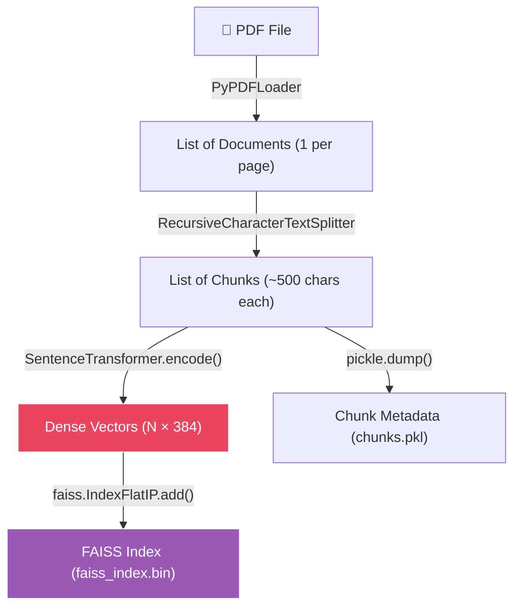

# 🔢 Embeddings & Vector Spaces

[← Previous: Chunking](../02-chunking/README.md) | [Back to Master README](../README.md) | [Next: Vector Stores →](../04-vector-stores/README.md)

---

## Table of Contents

- [Topic Overview](#topic-overview)
- [Why It Matters in RAG](#why-it-matters-in-rag)
- [Mental Model](#mental-model)
- [Core Theory](#core-theory)
- [Embedding Model Comparison](#embedding-model-comparison)
- [Normalization: Why It's Critical](#normalization-why-its-critical)
- [How It Works: The Full Pipeline](#how-it-works-the-full-pipeline)
- [Code Examples](#code-examples)
- [Understanding the Output Files](#understanding-the-output-files)
- [Common Mistakes](#common-mistakes)
- [Key Takeaways](#key-takeaways)
- [Checkpoint Questions](#checkpoint-questions)

---

## Topic Overview

An **embedding** is a dense numeric vector (typically 384 to 1536 dimensions) that captures the **semantic meaning** of a piece of text. Embeddings are what make retrieval possible — they allow you to measure the "distance" between a question and a document chunk in mathematical space.

---

## Why It Matters in RAG

Embeddings are the **bridge between text and retrieval**. After chunking, each chunk is just a string. To find which chunks are most relevant to a user's question, you need to convert both the question and all chunks into vectors, then find the nearest neighbors.


---

## Mental Model

Think of embeddings as **GPS coordinates for meaning**:

- Every piece of text gets a "location" in a high-dimensional space
- **Similar sentences → nearby coordinates** ("car repair" and "fix a vehicle" land close together)
- **Dissimilar sentences → far apart coordinates** ("car repair" and "chocolate cake recipe" land far apart)
- Finding relevant documents = finding the nearest points to your query's coordinates

---

## Core Theory

### What Is a Dense Vector?

A dense vector is an array of floating-point numbers (e.g., 384 numbers) where **every dimension carries information**. This is in contrast to sparse vectors (like TF-IDF) where most values are zero.

```
"How to fix a car" → [0.023, -0.145, 0.892, 0.001, ..., 0.334]  (384 dimensions)
"Vehicle repair manual" → [0.019, -0.138, 0.887, 0.005, ..., 0.329]  (very close!)
"Chocolate cake recipe" → [0.891, 0.234, -0.112, 0.445, ..., -0.221]  (very far!)
```

### Similarity Measures

| Measure | Formula | Range | Usage |
|---------|---------|-------|-------|
| **Cosine Similarity** | $\frac{\mathbf{A} \cdot \mathbf{B}}{\|\mathbf{A}\| \|\mathbf{B}\|}$ | [-1, 1] | Standard for text similarity |
| **Dot Product (Inner Product)** | $\mathbf{A} \cdot \mathbf{B}$ | (-∞, +∞) | Fast; equals cosine when vectors are normalized |
| **Euclidean Distance** | $\|\mathbf{A} - \mathbf{B}\|$ | [0, +∞) | Geometric distance; lower = more similar |

---

## Embedding Model Comparison

| Model | Dimensions | Strengths | Weaknesses | Cost |
|-------|-----------|-----------|------------|------|
| **Sentence-Transformers (`all-MiniLM-L6-v2`)** | 384 | Fast, good for generic English text, open-source | May miss domain-specific nuances | Free |
| **OpenAI `text-embedding-3-large`** | 1536 | Strong zero-shot performance, works well on code & legal text | Requires API key | Per-token pricing |
| **Cohere `embed-english-v3`** | ~4096 | Good balance of speed & quality | Subscription required | Subscription |
| **HuggingFace local models** | Variable | Fully offline, fully controllable | Larger memory footprint, slower | Free |

### When to Choose Which

- **Zero-cost, fast local experimentation on a modest-size PDF** → `all-MiniLM-L6-v2` (Sentence-Transformers)
- **Higher semantic fidelity for a large corpus with an API key** → `text-embedding-3-large` (OpenAI)

---

## Normalization: Why It's Critical

### The Problem Without Normalization

If two vectors are **not** normalized, their magnitudes affect the similarity score:

- A longer chunk with lots of repeated words produces a vector with **huge numbers** (high magnitude)
- In FAISS `IndexFlatIP` (inner product), it gets an **artificially high similarity score** — not because it's relevant, but because it's long!

### How Normalization Fixes It

When vectors are normalized (length $|\mathbf{A}| = 1$ and $|\mathbf{B}| = 1$):

$$\text{Cosine Similarity} = \frac{\mathbf{A} \cdot \mathbf{B}}{1 \times 1} = \mathbf{A} \cdot \mathbf{B}$$

The formula simplifies to just the **dot product**. Every chunk is on an equal playing field — similarity is based purely on meaning, not length.

```python
# ✅ Always normalize when using IndexFlatIP
embeddings = model.encode(texts, normalize_embeddings=True)
```

---

## How It Works: The Full Pipeline



1. **Load the PDF** → `PyPDFLoader` gives a list of Documents (one per page)
2. **Chunk the pages** → Splitter returns smaller Documents (chunks)
3. **Encode each chunk** → `SentenceTransformer.encode()` produces a 384-dim vector per chunk
4. **Store vectors in FAISS** → `faiss.IndexFlatIP` holds vectors for nearest-neighbor search
5. **Persist everything** → `chunks.pkl` maps vector IDs back to text; `faiss_index.bin` stores the index

---

## Code Examples

### Building a FAISS Index from PDF

```python
import os, pickle, faiss, numpy as np
from pathlib import Path
from langchain_community.document_loaders import PyPDFLoader
from langchain_text_splitters import RecursiveCharacterTextSplitter
from sentence_transformers import SentenceTransformer

# 1. Load PDF
loader = PyPDFLoader('document.pdf')
docs = loader.load()

# 2. Chunk
splitter = RecursiveCharacterTextSplitter(chunk_size=500, chunk_overlap=50)
chunks = splitter.split_documents(docs)

# 3. Embed
model = SentenceTransformer("all-MiniLM-L6-v2")
texts = [doc.page_content for doc in chunks]
embeddings = model.encode(texts, normalize_embeddings=True)  # shape: (N, 384)

# 4. Store in FAISS
dim = embeddings.shape[1]  # 384
index = faiss.IndexFlatIP(dim)  # Inner product (= cosine after normalization)
index.add(np.array(embeddings).astype("float32"))

# 5. Persist
faiss.write_index(index, "faiss_index.bin")
with open("chunks.pkl", "wb") as f:
    pickle.dump(chunks, f)

print(f"✅ FAISS index built — {len(chunks)} chunks stored")
```

### Verifying Retrieval Works

```python
import pickle, faiss, numpy as np
from sentence_transformers import SentenceTransformer

# Load saved index and metadata
index = faiss.read_index("faiss_index.bin")
with open("chunks.pkl", "rb") as f:
    chunks = pickle.load(f)

model = SentenceTransformer("all-MiniLM-L6-v2")

# Search
query = "What are the obligations of a data fiduciary?"
q_vec = model.encode([query], normalize_embeddings=True).astype("float32")
D, I = index.search(q_vec, k=3)  # D = distances, I = indices

for rank, idx in enumerate(I[0], start=1):
    doc = chunks[idx]
    print(f"Result {rank} (score={D[0][rank-1]:.4f}) — page {doc.metadata.get('page')}")
    print(doc.page_content[:300])
```

---

## Understanding the Output Files

| File | What It Stores | How It's Created | How It's Used |
|------|---------------|-----------------|---------------|
| **`chunks.pkl`** | A Python pickle containing a list of `Document` objects. Each has `page_content` (raw text) and `metadata` (source, page, etc.) | `pickle.dump(chunks, f)` after splitting | When retrieving a nearest-neighbor vector, the returned ID is used to look up the corresponding `Document` to get the original text |
| **`faiss_index.bin`** | A FAISS binary index storing dense vectors with an efficient ANN data structure | `faiss.IndexFlatIP(dim)` → `index.add(embeddings)` → `faiss.write_index()` | At query time: encode query → FAISS search → get top-k IDs → fetch matching Documents from `chunks.pkl` |

### The Complete Query Flow

```
User query → encode → FAISS search → get top-k IDs → fetch Documents from chunks.pkl → feed to LLM → answer
```

This is the classic **Retrieve → Augment → Generate** loop.

---

## Common Mistakes

1. **Using different models for indexing and querying** — the query vector must live in the same vector space as the document vectors
2. **Forgetting to normalize** — causes magnitude bias in similarity scores
3. **Not persisting the index** — recomputing embeddings from scratch every time is wasteful
4. **Choosing the wrong model** — using a code-trained model for legal text (or vice versa)
5. **Not installing dependencies** — `sentence_transformers` requires `torch` (PyTorch) as the tensor engine

### Why Both `torch` and `sentence_transformers`?

- **`torch`** provides the GPU/CPU tensor engine that computes embeddings efficiently
- **`sentence_transformers`** supplies the pre-trained embedding models that generate vector representations
- Without `torch`, `sentence_transformers` can't load or run any models

---

## Key Takeaways

1. **Embeddings convert text into dense numeric vectors** that capture semantic meaning
2. **Similar text → nearby vectors; dissimilar text → far apart vectors**
3. **Normalization is essential** when using inner-product similarity — it prevents magnitude bias
4. **Use the same model for indexing and querying** — vectors must share the same space
5. **`chunks.pkl` maps IDs to text; `faiss_index.bin` stores the vectors** — both are needed
6. **Model choice matters**: open-source (MiniLM) for prototyping, commercial (OpenAI) for production quality
7. **The full pipeline**: Load → Chunk → Embed → Store → (later) Query → Retrieve

---

## Checkpoint Questions

### Checkpoint 1: Embedding Model Selection

**Question:** You have two options: (1) `all-MiniLM-L6-v2` (open-source) and (2) OpenAI `text-embedding-3-large`. Which would you pick for zero-cost fast local experimentation? Which for higher semantic fidelity on a large corpus with an API key?

**Answer:**
- **Zero-cost, fast experimentation**: `all-MiniLM-L6-v2` — it's open-source, runs locally, and is fast enough for prototyping
- **Higher fidelity at scale**: `text-embedding-3-large` — stronger zero-shot performance, especially on diverse and domain-specific text

**Explanation:** The trade-off is cost vs. quality. MiniLM is free and fast but may miss domain-specific nuances. OpenAI's model has 1536 dimensions (vs. 384) and was trained on a broader corpus, but requires API calls and per-token payment.

---

### Checkpoint 2: Why Normalize?

**Question:** Why do we normalize the query embedding (`normalize_embeddings=True`) before feeding it to FAISS? What happens if we omit it?

**Answer:** Normalization ensures that similarity is based on **direction** (meaning), not **magnitude** (length). Without it, a longer chunk with repeated words gets an artificially high score because its vector has a larger magnitude — not because it's actually more relevant.

**Explanation:** When vectors are normalized to unit length, the inner product (dot product) becomes equivalent to cosine similarity. This puts all vectors on an equal playing field, so FAISS compares meaning rather than chunk length.

---

### Checkpoint 3: Dependencies

**Question:** Why do we need to install both `torch` and `sentence_transformers` before running the embedding script?

**Answer:** `torch` provides the GPU/CPU tensor engine that `sentence_transformers` relies on to compute embeddings efficiently, and `sentence_transformers` supplies the pre-trained embedding models that generate the vector representations used in the RAG pipeline.

**Explanation:** `sentence_transformers` is a high-level library that wraps transformer models for embedding generation. Under the hood, it uses PyTorch to perform the matrix multiplications and forward passes through the neural network. Without PyTorch installed, none of the models can load or run.

---

[← Previous: Chunking](../02-chunking/README.md) | [Back to Master README](../README.md) | [Next: Vector Stores →](../04-vector-stores/README.md)
