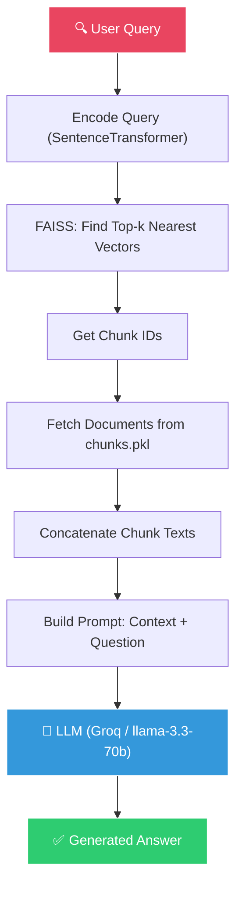

# 🔄 Retrieval & Generation: The Core RAG Loop

[← Previous: Vector Stores](../04-vector-stores/README.md) | [Back to Master README](../README.md) | [Next: Hybrid Search →](../06-hybrid-search/README.md)

---

## Table of Contents

- [Topic Overview](#topic-overview)
- [Why It Matters in RAG](#why-it-matters-in-rag)
- [Mental Model](#mental-model)
- [How It Works](#how-it-works)
- [Top-k: How Many Chunks to Retrieve](#top-k-how-many-chunks-to-retrieve)
- [The RAG Prompt Template](#the-rag-prompt-template)
- [Code: Complete RAG Pipeline](#code-complete-rag-pipeline)
- [The "Lost in the Middle" Problem](#the-lost-in-the-middle-problem)
- [Common Mistakes](#common-mistakes)
- [Key Takeaways](#key-takeaways)
- [Checkpoint Questions](#checkpoint-questions)

---

## Topic Overview

This is where everything comes together. **Retrieval & Generation** is the core loop of RAG — the moment where a user's question gets answered by retrieving relevant documents and feeding them to an LLM as context.

---

## Why It Matters in RAG

This is **the loop** that defines RAG:

1. **Retrieve** — find the most relevant chunks from your vector store
2. **Augment** — inject those chunks into the LLM's prompt as context
3. **Generate** — the LLM produces an answer grounded in the retrieved evidence

Without this step, you just have a search engine (retrieval without generation) or a vanilla LLM (generation without retrieval).

---

## Mental Model

Think of the RAG loop as a **student taking an open-book exam**:

1. **The question** = user query
2. **Looking up the textbook** = vector search retrieval
3. **Reading the relevant pages** = context construction
4. **Writing the answer based on what you read** = LLM generation

The student is *allowed* to reference the textbook, but must answer *based on what's written there*, not make things up.

---

## How It Works



**Step-by-step:**

| Step | What Happens |
|------|-------------|
| 1. Load | Reads the pickled chunks (raw text + metadata) and the FAISS index from disk |
| 2. Embed | Encodes the user query using the **same** SentenceTransformer used for indexing |
| 3. Retrieve | FAISS search → returns the k most similar chunk IDs and their similarity scores |
| 4. Prompt | Concatenates the retrieved chunk texts and injects them into a prompt template |
| 5. Generate | The LLM reads the context and generates an answer **only** from the provided text |

---

## Top-k: How Many Chunks to Retrieve

`k` stands for **"Top-k Nearest Neighbors"**. When you set `k=3`, you're telling the database:

> "Rank every chunk by similarity to my question, and give me the top 3."

### The Critical Trap

**`k` is a strict count, not a relevance threshold.** FAISS always returns exactly `k` results, even if none are relevant!

| Query | Scores | Verdict |
|-------|--------|---------|
| "What are the penalties for data breach?" (relevant) | 0.88, 0.84, 0.81 | ✅ Highly relevant |
| "How do I make chocolate chip cookies?" (irrelevant) | 0.15, 0.12, 0.08 | ❌ Useless noise — but still returns 3 results! |

### The Trade-off Table

| Setting | Consequence |
|---------|------------|
| **k too small** (e.g., k=1) | If an answer spans multiple paragraphs, you only get half the picture → incomplete answer |
| **k too large** (e.g., k=20) | Floods the prompt with irrelevant noise → LLM gets confused, costs more, takes longer, suffers from "Lost in the Middle" |
| **k = 3 to 5** | Standard range for most RAG applications |

### Production Approach: Score Threshold

In production, combine `k` with a **score threshold**:

```python
# "Give me top 5, but discard any chunk with score < 0.65"
D, I = index.search(q_vec, k=5)
filtered = [(chunks[i], score) for i, score in zip(I[0], D[0]) if score >= 0.65]
```

---

## The RAG Prompt Template

The prompt is what constrains the LLM to answer **only** from retrieved context:

```python
from langchain_core.prompts import PromptTemplate

prompt = PromptTemplate(
    template="""
You are a helpful assistant that answers questions *only* based on the provided context.
If the answer cannot be found in the context, say "I don't know based on the given documents."

Context:
{retrieved_context}

Question: {question}
""",
    input_variables=["retrieved_context", "question"],
)
```

**Key design decisions:**
- **"only based on the provided context"** — prevents the LLM from using its pretraining knowledge
- **"I don't know"** — provides a graceful fallback instead of hallucination
- **Context before question** — positions the evidence where the LLM's attention is strongest

---

## Code: Complete RAG Pipeline

```python
import pathlib, pickle, faiss, numpy as np
from sentence_transformers import SentenceTransformer
from langchain_groq import ChatGroq
from langchain_core.prompts import PromptTemplate
from langchain_core.output_parsers import StrOutputParser
import os
from dotenv import load_dotenv

# 1. Load the vector store and chunk metadata
with open("chunks.pkl", "rb") as f:
    chunks = pickle.load(f)
index = faiss.read_index("faiss_index.bin")

# 2. Load the embedding model (same one used for indexing!)
embed_model = SentenceTransformer("all-MiniLM-L6-v2")

# 3. Retrieve function
def retrieve(query: str, k: int = 3):
    q_vec = embed_model.encode([query], normalize_embeddings=True).astype("float32")
    distances, ids = index.search(q_vec, k)
    retrieved = [chunks[i] for i in ids[0]]
    return retrieved, distances[0]

# 4. LLM setup (Groq)
load_dotenv()
llm = ChatGroq(
    model="llama-3.3-70b-versatile",
    api_key=os.getenv("GROQ_API_KEY"),
    temperature=0.0,
)

prompt = PromptTemplate(
    template="""
You are a helpful assistant that answers questions *only* based on the provided context.
If the answer cannot be found in the context, say "I don't know based on the given documents."

Context:
{retrieved_context}

Question: {question}
""",
    input_variables=["retrieved_context", "question"],
)

parser = StrOutputParser()
chain = prompt | llm | parser

# 5. Run a demo query
user_question = "What are the obligations of a data fiduciary?"
retrieved_chunks, scores = retrieve(user_question, k=3)
context = "\n---\n".join(chunk.page_content for chunk in retrieved_chunks)

answer = chain.invoke({
    "retrieved_context": context,
    "question": user_question,
})

print("🔎 Retrieved chunk scores:", scores)
print("\n📝 Answer:\n", answer)
```

**Expected output:**
```
🔎 Retrieved chunk scores: [0.9387 0.9231 0.9115]

📝 Answer:
The obligations of a data fiduciary include (1) processing personal data only for
lawful purposes, (2) obtaining explicit consent from data principals, (3) ensuring
data security measures, (4) providing mechanisms for data correction and erasure,
and (5) reporting any data breaches to the Data Protection Board of India within
the prescribed timeframe.
```

---

## The "Lost in the Middle" Problem

Research has shown that LLMs **pay attention to the start and end of the context**, but tend to **ignore details buried in the middle**.

```
Context position:  [Beginning]  [Middle]  [End]
LLM attention:       HIGH        LOW      HIGH
```

**Implications for RAG:**
- If you retrieve 20 chunks, the LLM may miss the answer if it's in chunk #10
- Keep `k` small (3–5) to ensure all context receives attention
- Or use re-ranking (covered in [07-reranking](../07-reranking/README.md)) to put the most relevant chunk first

---

## Common Mistakes

1. **Not constraining the prompt** — without "only based on context", the LLM uses pretraining knowledge and may hallucinate
2. **Setting k too high** — floods the context with noise; consider the "Lost in the Middle" effect
3. **No fallback for irrelevant retrieval** — always include "I don't know" instructions in the prompt
4. **Using a different embedding model for queries vs. documents** — vectors won't be comparable
5. **Ignoring similarity scores** — even with k=3, if all scores are < 0.2, the results are meaningless

---

## Key Takeaways

1. **The RAG loop: Retrieve → Augment → Generate** — this is the essence of RAG
2. **k is a count, not a quality filter** — FAISS always returns k results, even if irrelevant
3. **k = 3 to 5 is the standard range** — augmented with score thresholds in production
4. **The prompt template is crucial** — it constrains the LLM to answer from context only
5. **"Lost in the Middle"** — LLMs attend to start and end; keep context focused
6. **Same embedding model for indexing and querying** — this is non-negotiable
7. **Score thresholds** prevent feeding irrelevant noise to the LLM

---

## Checkpoint Questions

### Checkpoint 1: Normalization Purpose

**Question:** In the retrieval script, why do we normalize the query embedding (`normalize_embeddings=True`) before feeding it to FAISS, and what would happen if we omitted it?

**Answer:** Normalization ensures that the dot product (inner product) equals cosine similarity. Without normalization, chunks with larger vector magnitudes (often longer, repetitive text) get artificially higher scores regardless of actual relevance, corrupting the ranking.

**Explanation:** FAISS `IndexFlatIP` computes raw inner products. If vectors have different magnitudes, a long, rambling chunk could outscore a concise, perfectly relevant chunk simply because its vector is "bigger." Normalization (setting all vector lengths to 1.0) neutralizes magnitude, making similarity purely about direction — i.e., semantic meaning.

---

### Checkpoint 2: Top-k Relevance

**Question:** If a user asks "How do I make chocolate chip cookies?" to a legal document RAG system with k=3, what happens?

**Answer:** FAISS still returns 3 results — the 3 *least irrelevant* legal clauses. Their scores will be very low (e.g., 0.15, 0.12, 0.08), meaning they are essentially noise. The LLM will either hallucinate an answer from its pretraining data or (if the prompt is well-designed) respond "I don't know based on the given documents."

**Explanation:** `k` is a strict count. FAISS doesn't have a concept of "no results found." In production, always pair `k` with a **score threshold** to filter out low-confidence retrievals before feeding them to the LLM.

---

[← Previous: Vector Stores](../04-vector-stores/README.md) | [Back to Master README](../README.md) | [Next: Hybrid Search →](../06-hybrid-search/README.md)
