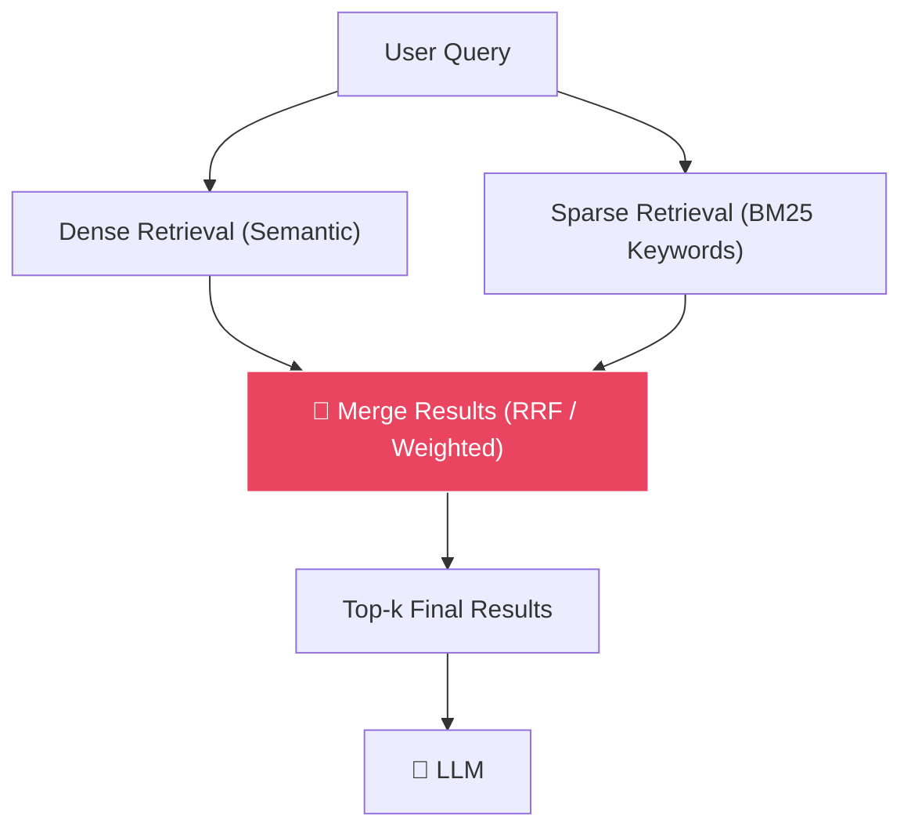
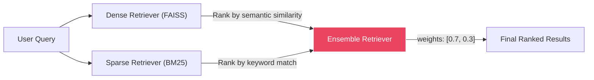

# 🔀 Hybrid Search: Dense + Sparse Retrieval

[← Previous: Retrieval & Generation](../05-retrieval-and-generation/README.md) | [Back to Master README](../README.md) | [Next: Re-Ranking →](../07-reranking/README.md)

---

## Table of Contents

- [Topic Overview](#topic-overview)
- [Why It Matters in RAG](#why-it-matters-in-rag)
- [Mental Model](#mental-model)
- [Core Theory: Two Types of Retrieval](#core-theory-two-types-of-retrieval)
- [The Hybrid Solution](#the-hybrid-solution)
- [How Reciprocal Rank Fusion Works](#how-reciprocal-rank-fusion-works)
- [Code: Implementing Hybrid Search](#code-implementing-hybrid-search)
- [Comparison Table](#comparison-table)
- [Common Mistakes](#common-mistakes)
- [Key Takeaways](#key-takeaways)
- [Checkpoint Questions](#checkpoint-questions)

---

## Topic Overview

Pure vector search (dense retrieval) fails in specific, frustrating ways — particularly with exact keywords, serial numbers, and error codes. **Hybrid Search** combines dense (semantic) retrieval with sparse (keyword) retrieval to get the best of both worlds.

---

## Why It Matters in RAG

In production RAG, users ask questions that require **both** semantic understanding and exact keyword matching. Neither retrieval method alone is sufficient:



---

## Mental Model

Think of it as **two different librarians** helping you find a book:

- **Librarian A (Dense/Semantic):** Understands *meaning*. If you ask for "cute canine photos," they'll find the "adorable dog pictures" section — even though no words match exactly
- **Librarian B (Sparse/BM25):** Understands *exact words*. If you ask for "ISBN 978-0-13-468599-1," they'll find that exact book immediately — something Librarian A can't do

**Hybrid Search** = ask *both* librarians, then combine their recommendations.

---

## Core Theory: Two Types of Retrieval

### A. Dense Retrieval (Embeddings / Vectors)

| Aspect | Detail |
|--------|--------|
| **How it works** | Encodes the meaning of sentences into continuous vectors |
| **Strength** | Excellent at semantic understanding and synonyms |
| **Example** | Searching "how to fix a vehicle" finds "car repair manual" |
| **Weakness** | Terrible with exact keywords, part numbers, error codes, unique entity names |
| **Why it fails** | Embeddings blur unique strings into general concepts. Error code `XJ-904-TIMEOUT` gets tokenized into fragments (`X`, `J`, `-`, `904`, `TIME`, `OUT`) that lose their specific meaning |

### B. Sparse Retrieval (BM25 / Keyword Search)

| Aspect | Detail |
|--------|--------|
| **How it works** | Traditional term-frequency algorithm (BM25 = advanced TF-IDF). Counts exact keyword matches, weights rare words higher |
| **Strength** | Unbeatable at exact string matching — serial numbers, codes, acronyms |
| **Example** | Searching "ERR_404_AUTH_FAIL" finds the exact document containing that error code |
| **Weakness** | Zero semantic understanding. Searching "cute canine" when the document says "adorable dog" finds **nothing** |

### Why Dense Retrieval Struggles with Error Codes

Dense embedding models use **tokenizers** that break unknown strings into tiny fragments:

```
"XJ-904-TIMEOUT" → [X] [J] [-] [904] [TIME] [OUT]
```

Because the model was never trained on proprietary error codes, the resulting vector becomes **noisy**. It might retrieve general articles about "servers" or "timeouts" while completely missing the specific paragraph about `XJ-904-TIMEOUT`.

---

## The Hybrid Solution

Combine both! Run the query through Dense (Embeddings) **AND** Sparse (BM25) simultaneously, then merge results using **Reciprocal Rank Fusion (RRF)** or weighted scoring.



### Weight Configuration

```python
weights = [0.7, 0.3]  # 70% semantic, 30% keyword
```

- **Higher dense weight** (0.7): Better for natural language questions
- **Higher sparse weight** (0.3): Better for queries with specific terms, codes, or identifiers
- Weights are tunable based on your use case

---

## How Reciprocal Rank Fusion Works

RRF merges ranked lists by giving each document a score based on its **rank position** in each retrieval method:

$$\text{RRF}(d) = \sum_{r \in \text{retrievers}} \frac{1}{k + \text{rank}_r(d)}$$

Where `k` is a constant (typically 60). Documents that appear high in *multiple* lists get the highest combined scores.

---

## Code: Implementing Hybrid Search

### Setting Up Dense + Sparse Retrievers

```python
from langchain_community.embeddings import HuggingFaceEmbeddings
from langchain_community.vectorstores import FAISS
from langchain_community.retrievers import BM25Retriever

# Dense Retriever (semantic)
embedding_model = HuggingFaceEmbeddings(model_name="all-MiniLM-L6-v2")
dense_vectorstore = FAISS.from_documents(docs, embedding_model)
dense_retriever = dense_vectorstore.as_retriever()

# Sparse Retriever (keyword / BM25)
sparse_retriever = BM25Retriever.from_documents(docs)
sparse_retriever.k = 3
```

### Creating the Hybrid Ensemble

```python
from langchain.retrievers import EnsembleRetriever

hybrid_retriever = EnsembleRetriever(
    retrievers=[dense_retriever, sparse_retriever],
    weights=[0.7, 0.3]  # 70% weight to Semantic, 30% to Exact Keywords
)

# Use it like any other retriever
results = hybrid_retriever.invoke("How do I fix error code XJ-904-TIMEOUT?")
```

---

## Comparison Table

| Aspect | Dense Only | Sparse Only | Hybrid |
|--------|-----------|-------------|--------|
| **Semantic queries** ("how to fix a vehicle") | ✅ Excellent | ❌ Fails (no exact match) | ✅ Excellent |
| **Exact keywords** ("ERR_404_AUTH_FAIL") | ❌ Poor | ✅ Excellent | ✅ Excellent |
| **Synonym handling** | ✅ Built-in | ❌ None | ✅ From dense component |
| **Rare term matching** | ❌ Weak | ✅ Strong (BM25 upweights rare terms) | ✅ From sparse component |
| **Implementation complexity** | Simple | Simple | Moderate (two retrievers + fusion) |
| **Industry adoption** | Prototypes | Legacy search | **Production standard** |

---

## Common Mistakes

1. **Using only dense retrieval in production** — fails silently on exact keywords and codes
2. **Setting weights without testing** — the optimal 70/30 split depends on your data and query patterns
3. **Ignoring BM25 entirely** — even in 2026, keyword matching is essential for certain query types
4. **Not testing with edge cases** — always test with queries containing serial numbers, codes, and domain-specific terminology

---

## Key Takeaways

1. **Pure embedding search fails with exact keywords** — error codes, serial numbers, and acronyms get tokenized into noise
2. **BM25 (sparse) excels at exact matching** but has zero semantic understanding
3. **Hybrid Search = Dense + Sparse** — combines the strengths of both approaches
4. **EnsembleRetriever** merges results with configurable weights (e.g., 70% semantic, 30% keyword)
5. **Hybrid Search is the production industry standard** — don't ship production RAG with dense-only retrieval
6. **Weights are tunable** — higher dense weight for conversational queries, higher sparse for technical/code queries

---

## Checkpoint Questions

### Checkpoint 1: Error Code Search

**Question:** A user searches an internal knowledge base with: "How do I fix error code XJ-904-TIMEOUT on the payments server?" Between dense retrieval and sparse retrieval (BM25): (1) Which one is most likely to find the exact document containing `XJ-904-TIMEOUT`? (2) Why would pure embedding search struggle?

**Answer:**

1. **Sparse Retriever (BM25)** — it matches the exact characters `XJ-904-TIMEOUT` effortlessly
2. **Dense embedding models** break unknown strings into sub-word tokens (`X`, `J`, `-`, `904`, `TIME`, `OUT`). Because the model was never trained on this proprietary error code, the vector becomes noisy — it might retrieve general articles about "servers" or "timeouts" while missing the specific paragraph containing `XJ-904-TIMEOUT`

**Explanation:** This is why Hybrid Search is an industry standard. Dense retrieval captures the semantic intent ("fix" + "payments server"), while sparse retrieval captures the exact identifier (`XJ-904-TIMEOUT`). Together, they find the right document that neither could find alone.

---

[← Previous: Retrieval & Generation](../05-retrieval-and-generation/README.md) | [Back to Master README](../README.md) | [Next: Re-Ranking →](../07-reranking/README.md)
