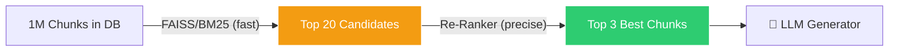
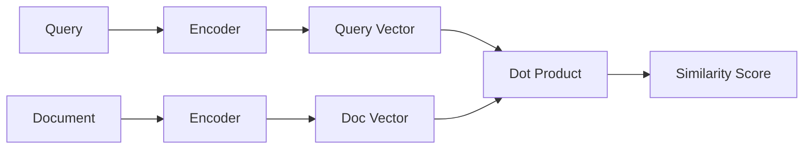
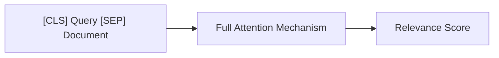
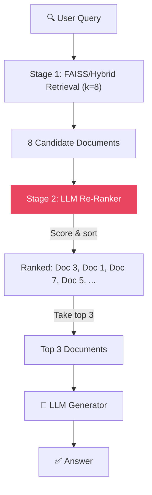

# 🏆 Re-Ranking: The Two-Stage Retrieval Funnel

[← Previous: Hybrid Search](../06-hybrid-search/README.md) | [Back to Master README](../README.md) | [Next: Query Translation (HyDE) →](../08-query-translation/README.md)

---

## Table of Contents

- [Topic Overview](#topic-overview)
- [Why It Matters in RAG](#why-it-matters-in-rag)
- [Mental Model](#mental-model)
- [Core Theory: Bi-Encoder vs Cross-Encoder](#core-theory-bi-encoder-vs-cross-encoder)
- [The Two-Stage Funnel Architecture](#the-two-stage-funnel-architecture)
- [How It Works](#how-it-works)
- [Code: LLM-Based Re-Ranking](#code-llm-based-re-ranking)
- [Comparison Table](#comparison-table)
- [Common Mistakes](#common-mistakes)
- [Key Takeaways](#key-takeaways)
- [Checkpoint Questions](#checkpoint-questions)

---

## Topic Overview

**Re-ranking** is the process of taking a broad set of initially retrieved documents and **re-ordering them by true relevance** using a more powerful (but slower) model. It bridges the gap between fast-but-coarse initial retrieval and the precise context the LLM needs.

---

## Why It Matters in RAG

The initial retrieval step (FAISS/BM25) is designed for **speed**, not precision. It can scan millions of documents in milliseconds, but its relevance rankings are approximate. A re-ranker adds a second layer of **precision** to ensure the LLM receives only the most truly relevant context.



---

## Mental Model

Think of it as a **job hiring funnel**:

1. **Resume screening** (FAISS/BM25) — quickly scan 10,000 resumes, shortlist 20 candidates based on keywords and relevance
2. **In-depth interviews** (Re-ranker) — carefully evaluate those 20 candidates, select the top 3 for the final round

You can't interview 10,000 people (too slow), and you can't skip screening (you'd miss great candidates). You need **both stages**.

---

## Core Theory: Bi-Encoder vs Cross-Encoder

The key to understanding re-ranking is the difference between how initial retrieval and re-ranking models process text:

### Bi-Encoder (Stage 1: Initial Retrieval)



- The query and document are embedded **separately** into independent vectors
- Similarity = dot product (or cosine) between two vectors
- ⚡ **Ultra-fast** — can pre-compute all document vectors; at query time, only encode the query
- 📉 **Coarse** — loses subtle query-document relationships because they never "see" each other

### Cross-Encoder (Stage 2: Re-Ranking)



- The query and document are passed **together** through the attention mechanism
- The model sees the full interaction between query terms and document terms
- 🎯 **Extremely accurate** — captures nuanced relevance
- 🐢 **Computationally slow** — cannot be pre-computed; must process each query-document pair

---

## The Two-Stage Funnel Architecture

| Stage | Model Type | How It Works | Speed | Quality |
|-------|-----------|-------------|-------|---------|
| **Stage 1: Retrieval** | Bi-Encoder | Query and document embedded separately; dot product similarity | ⚡ Ultra-fast (scans 1M+ docs in ms) | Coarse — good recall, weak precision |
| **Stage 2: Re-Ranking** | Cross-Encoder / LLM | Query and document passed together through attention | 🐢 Slow (processes only k candidates) | 🎯 Extremely precise |

### Why This Works

- **Stage 1 optimizes for Recall** — cast a wide net (k=20–30) to ensure you don't miss anything relevant
- **Stage 2 optimizes for Precision** — scrutinize only the shortlisted candidates to eliminate false positives

---

## How It Works



**Step-by-step:**

1. **Broad retrieval** — retrieve k=8 (or 20) candidate chunks using FAISS/Hybrid search
2. **Format for re-ranking** — present all 8 documents along with the user's question to the re-ranker
3. **Score and sort** — the re-ranker (Cross-Encoder or LLM) scores each document's relevance
4. **Select top-n** — take the top 3–5 highest-scored documents
5. **Generate** — feed only those top documents to the final LLM for answer generation

---

## Code: LLM-Based Re-Ranking

### Broad Retrieval

```python
# Cast a wider net than usual
retriever = vectorstore.as_retriever(search_kwargs={"k": 8})
```

### Re-Ranking Prompt

```python
from langchain_core.prompts import PromptTemplate

rerank_prompt = PromptTemplate.from_template("""
You are a helpful assistant. Your task is to rank the following documents
from most to least relevant to the user's question.

User Question: "{question}"

Documents:
{documents}

Instructions:
- Think about the relevance of each document to the user's question.
- Return a list of document indices in ranked order, starting from the most relevant.

Output format: comma-separated document indices (e.g., 2,1,3,0,...)
""")
```

### Re-Ranking Execution

```python
# Use LLM (e.g., Groq) as the re-ranker
ranked_indices = rerank_chain.invoke({
    "question": user_question,
    "documents": formatted_docs  # All 8 documents formatted with indices
})

# Parse the output and take top 3
top_indices = [int(i.strip()) for i in ranked_indices.split(",")][:3]
top_docs = [candidates[i] for i in top_indices]
```

### Alternative: Dedicated Re-Ranking Models

```python
# Using Cohere Rerank (production-grade)
from langchain.retrievers import CohereRerank

reranker = CohereRerank(top_n=3)
reranked_docs = reranker.compress_documents(candidates, query)

# Using BGE-Reranker (open-source)
from sentence_transformers import CrossEncoder

cross_encoder = CrossEncoder("BAAI/bge-reranker-base")
scores = cross_encoder.predict([(query, doc.page_content) for doc in candidates])
```

---

## Comparison Table

| Re-Ranking Approach | Speed | Quality | Cost | Best For |
|--------------------|-------|---------|------|----------|
| **LLM-based re-ranking** (e.g., GPT-4, Groq) | Slow | Very high (reasoning) | API costs | Complex queries requiring reasoning |
| **Cross-Encoder** (e.g., BGE-Reranker) | Moderate | High | Free (open-source) | Production with good balance |
| **Cohere Rerank** | Fast | Very high | Subscription | Enterprise production |
| **No re-ranking** | Fastest | Lowest | Free | Simple prototypes only |

---

## Common Mistakes

1. **Skipping re-ranking entirely** — initial retrieval alone often returns false positives
2. **Re-ranking the entire database** — defeats the purpose; only re-rank the shortlisted candidates
3. **Setting initial retrieval k too low** — if you only retrieve 3 docs, there's nothing meaningful to re-rank
4. **Not using a diverse candidate pool** — use hybrid search before re-ranking for better coverage

---

## Key Takeaways

1. **Two-stage funnel: Recall (FAISS) → Precision (Re-ranker)** — the standard production architecture
2. **Bi-Encoders are fast but coarse** — embed query and document separately, lose subtle interactions
3. **Cross-Encoders are precise but slow** — process query + document together through attention
4. **You cannot run the Cross-Encoder over 1M documents** — that's why Stage 1 exists
5. **Retrieve broadly (k=20), re-rank to top 3–5** — this gives the best quality-speed tradeoff
6. **LLMs can serve as re-rankers** by scoring and sorting document relevance

---

## Checkpoint Questions

### Checkpoint 1: Why Not Skip Stage 1?

**Question:** Why do we not just use the Cross-Encoder / LLM Re-ranker directly over our entire 100,000-document database to find the best documents, instead of doing FAISS/BM25 first?

**Answer:** Because Cross-Encoders and LLMs are computationally expensive — they need to process the full query-document pair through attention for each document. Running this over 100,000 documents would take hours and cost a fortune in API calls. FAISS/BM25 screens the database in milliseconds to produce a shortlist of ~20 candidates, which the re-ranker can then process in seconds.

**Explanation:** Bi-encoders (FAISS/BM25) optimize for **Recall** — screening 100,000+ chunks in milliseconds to ensure nothing relevant is missed. Cross-Encoders/LLM Re-rankers optimize for **Precision** — scrutinizing only the top candidates to eliminate subtle false positives. Together, they form a **funnel** that is both fast and accurate.

---

[← Previous: Hybrid Search](../06-hybrid-search/README.md) | [Back to Master README](../README.md) | [Next: Query Translation (HyDE) →](../08-query-translation/README.md)
