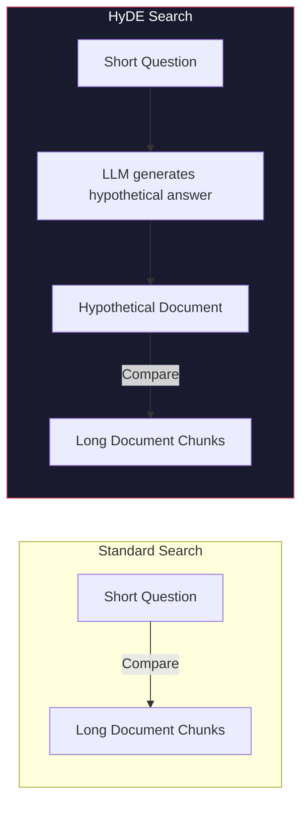
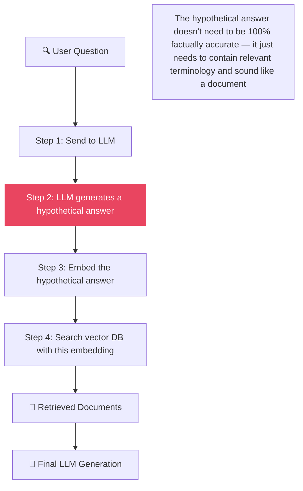

# 🔄 Query Translation: HyDE (Hypothetical Document Embeddings)

[← Previous: Re-Ranking](../07-reranking/README.md) | [Back to Master README](../README.md) | [Next: Corrective RAG →](../09-corrective-rag/README.md)

---

## Table of Contents

- [Topic Overview](#topic-overview)
- [Why It Matters in RAG](#why-it-matters-in-rag)
- [Mental Model](#mental-model)
- [Core Theory: The Asymmetric Search Problem](#core-theory-the-asymmetric-search-problem)
- [How HyDE Works](#how-hyde-works)
- [Code Examples](#code-examples)
- [Failure Modes](#failure-modes)
- [When to Use HyDE](#when-to-use-hyde)
- [Common Mistakes](#common-mistakes)
- [Key Takeaways](#key-takeaways)
- [Checkpoint Questions](#checkpoint-questions)

---

## Topic Overview

**HyDE (Hypothetical Document Embeddings)** is an advanced query translation technique that improves retrieval by transforming a user's question into a **hypothetical answer** before searching. Instead of searching with a short question, you search with a document-like passage — dramatically improving vector similarity.

---

## Why It Matters in RAG

Standard vector search compares a **short question** against **long document chunks**. These are fundamentally different in structure, length, and language style — causing a mismatch in embedding space that reduces retrieval quality.



---

## Mental Model

Imagine you're searching a library:

- **Standard search:** You walk up to the librarian and say "Why was Steve Jobs fired?" The librarian looks through the card catalog for books with those exact words — but most books don't phrase it as a question
- **HyDE search:** You first *imagine* what the answer might look like: "In 1985, following a boardroom power struggle with CEO John Sculley over the Macintosh division..." Then you search for books containing passages that *look like* your imagined answer — much more effective!

The hypothetical answer doesn't need to be perfectly accurate — it just needs to **sound like** the kind of document you're looking for.

---

## Core Theory: The Asymmetric Search Problem

### The Problem

Questions and answers look syntactically different, so their embeddings sit in **slightly different regions** of vector space:

| Text Type | Example | Characteristics |
|-----------|---------|----------------|
| **User Question** | "Why was Steve Jobs fired from Apple?" | Short, interrogative, ambiguous |
| **Document Chunk** | "In September 1985, following an intense boardroom power struggle with CEO John Sculley regarding Macintosh division sales, the board stripped Jobs of his managerial duties..." | Long, factual, dense, narrative |

Because these look so different, cosine similarity between the question vector and the answer vector is **lower than it should be** — even when the document contains the perfect answer.

### The Solution

Transform the question into something that **looks like a document** before searching. Since you're now comparing answer-like text against answer-like documents, vector similarity is dramatically higher.

---

## How HyDE Works



**The 3-step trick:**

1. **Take the user's question** and pass it to an LLM: *"Imagine you are an expert. Write a hypothetical answer to: 'Why was Steve Jobs fired from Apple?'"*
2. **The LLM generates a fictional/hypothetical passage.** It doesn't even need to be 100% accurate — it just needs to sound like an informative document with relevant terminology
3. **Embed the generated hypothetical answer** and use *that* vector to search your database

Because you are now searching an **answer-like vector** against **answer-like documents**, vector similarity is dramatically higher.

---

## Code Examples

### Custom HyDE Implementation

```python
from langchain_groq import ChatGroq
from langchain_core.prompts import PromptTemplate

# Step 1: Generate a hypothetical document
hyde_prompt = PromptTemplate.from_template("""
You are an expert. Write a detailed, factual paragraph that would answer
the following question. Do not say "I don't know." Write as if you are
authoring a reference document.

Question: {question}

Hypothetical Answer:
""")

llm = ChatGroq(model="llama-3.3-70b-versatile", temperature=0.0)

def get_hyde_doc(query: str) -> str:
    """Generate a hypothetical document for the query."""
    chain = hyde_prompt | llm
    return chain.invoke({"question": query}).content

# Step 2: Use the hypothetical doc for retrieval
query = "When was Steve Jobs fired from Apple?"
hypothetical_doc = get_hyde_doc(query)

# Step 3: Retrieve using the hypothetical answer text instead of the raw question!
matched_docs = base_retriever.invoke(hypothetical_doc)
```

### LangChain Built-in HyDE Wrapper

```python
from langchain.chains.hyde.base import HypotheticalDocumentEmbedder
from langchain_community.embeddings import HuggingFaceEmbeddings

embeddings = HypotheticalDocumentEmbedder.from_llm(
    llm=llm,
    base_embeddings=HuggingFaceEmbeddings(model_name="all-MiniLM-L6-v2"),
    prompt_key="web_search"
)

# Now use `embeddings` as your embedding model — it automatically generates
# hypothetical documents and embeds them instead of raw queries
vectorstore = FAISS.from_documents(docs, embeddings)
```

---

## Failure Modes

### The Hallucinated Hypothetical Document

**The major risk of HyDE:** If the LLM hallucinates an inaccurate hypothetical document, the search vector becomes **completely poisoned**.

| Scenario | What Happens |
|----------|-------------|
| **User asks about a well-known topic** | LLM generates a reasonable hypothetical → retrieval improves ✅ |
| **User asks about a niche, proprietary internal tool** | LLM has never seen this tool during training → generates a **hallucinated** hypothetical → searches for the wrong concepts → retrieves irrelevant documents → final answer is wrong ❌ |

### The Failure Chain

```
Obscure question
    ↓
LLM hallucinates a wrong hypothetical document
    ↓
The embedding vector represents the hallucinated (wrong) content
    ↓
FAISS searches for this wrong content
    ↓
Returns completely irrelevant chunks
    ↓
Final LLM receives wrong context
    ↓
Final answer is wrong or nonsensical
```

### Mitigation Strategies

- **Use HyDE selectively** — only for query types where the LLM has general knowledge
- **Combine with standard retrieval** — run both HyDE and standard search, merge results
- **Validate retrieval scores** — if HyDE results have low similarity scores, fall back to standard search

---

## When to Use HyDE

| Scenario | Use HyDE? | Why |
|----------|-----------|-----|
| General knowledge questions | ✅ Yes | LLM can generate reasonable hypotheticals |
| Well-documented domains (medicine, law, tech) | ✅ Yes | Training data covers these domains |
| Proprietary internal tools/systems | ❌ No | LLM will hallucinate about unknown tools |
| Queries with specific codes/IDs | ❌ No | HyDE adds noise; use BM25 instead |
| Short, ambiguous queries | ✅ Yes | HyDE expands them into richer search terms |

---

## Common Mistakes

1. **Using HyDE for everything** — it adds latency (extra LLM call) and can poison results for niche queries
2. **Trusting the hypothetical document's accuracy** — it's a search tool, not a fact source
3. **Not having a fallback** — always have standard retrieval as a backup
4. **Ignoring the latency cost** — HyDE requires an extra LLM API call before retrieval even begins

---

## Key Takeaways

1. **The Asymmetric Search Problem:** Questions and documents look different → their embeddings don't align well
2. **HyDE solves this** by generating a hypothetical answer and searching with *that* instead
3. **The hypothetical doesn't need to be accurate** — it just needs to contain relevant terminology
4. **Major risk:** If the LLM hallucinates, the entire retrieval is poisoned
5. **Best for:** General knowledge queries, well-documented domains, ambiguous short queries
6. **Avoid for:** Proprietary systems, specific codes/IDs, niche internal tools
7. **Always have a fallback** to standard retrieval

---

## Checkpoint Questions

### Checkpoint 1: HyDE Failure Mode

**Question:** What is one major risk of using HyDE if the user asks a very obscure question about a niche proprietary internal tool that the LLM has never seen during its training?

**Answer:** The LLM will generate a wrong/hallucinated hypothetical document. This poisoned hypothetical gets embedded and used for search, causing FAISS to retrieve completely irrelevant chunks. The final LLM receives wrong context and produces a poor or nonsensical response.

**Explanation:** HyDE's effectiveness depends entirely on the LLM's ability to generate a *plausible* hypothetical answer. For topics the LLM has never encountered (proprietary internal tools, custom error codes, company-specific processes), it can only guess — and those guesses introduce noise rather than signal into the search vector. The entire pipeline collapses because the first step (hypothetical generation) was built on hallucination.

---

[← Previous: Re-Ranking](../07-reranking/README.md) | [Back to Master README](../README.md) | [Next: Corrective RAG →](../09-corrective-rag/README.md)
