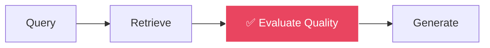
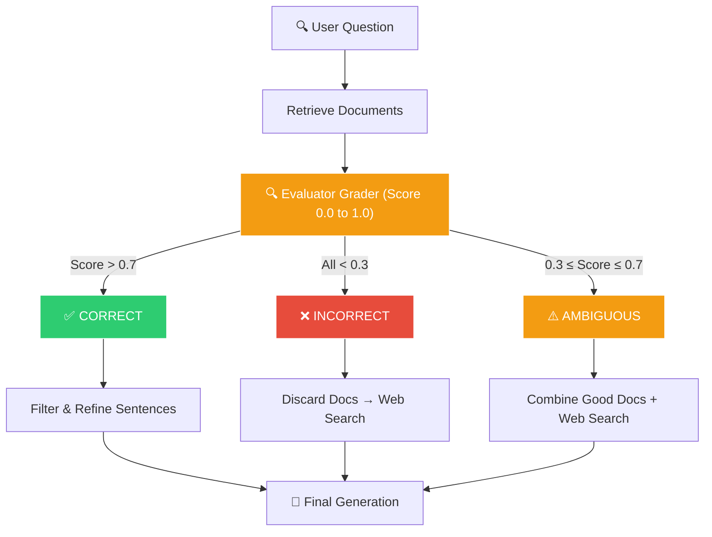
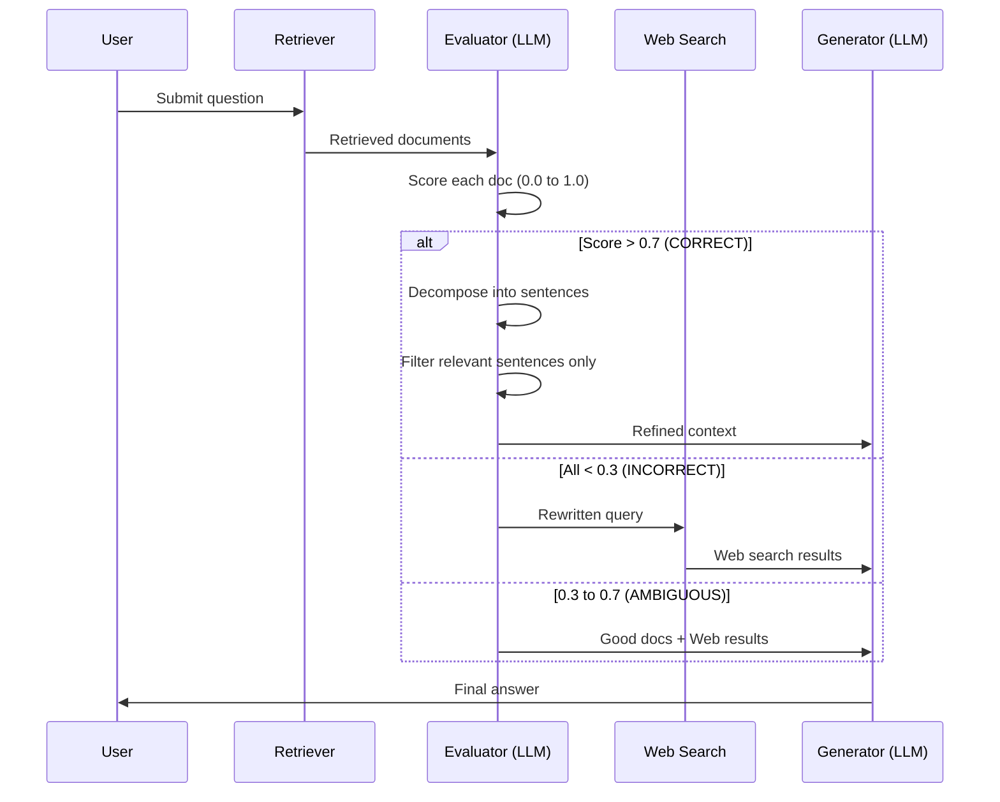

# 🔧 Corrective RAG (CRAG)

[← Previous: Query Translation (HyDE)](../08-query-translation/README.md) | [Back to Master README](../README.md) | [Next: Self-RAG →](../10-self-rag/README.md)

---

## Table of Contents

- [Topic Overview](#topic-overview)
- [Why It Matters in RAG](#why-it-matters-in-rag)
- [Mental Model](#mental-model)
- [Core Theory: The CRAG State Machine](#core-theory-the-crag-state-machine)
- [The Three Verdict Paths](#the-three-verdict-paths)
- [Knowledge Refinement](#knowledge-refinement)
- [How It Works: Step by Step](#how-it-works-step-by-step)
- [Code Examples](#code-examples)
- [Comparison: Linear RAG vs CRAG](#comparison-linear-rag-vs-crag)
- [Common Mistakes](#common-mistakes)
- [Key Takeaways](#key-takeaways)
- [Checkpoint Questions](#checkpoint-questions)

---

## Topic Overview

**Corrective RAG (CRAG)** is a self-correcting retrieval architecture that **evaluates the quality of retrieved documents before generating an answer**. Instead of blindly trusting the retriever, CRAG introduces an LLM evaluator (grader) that scores documents and decides whether to use them, discard them, or supplement them with web search.

---

## Why It Matters in RAG

Until now, all RAG pipelines have been **linear**:

```
Query → Retrieve → Generate
```

**The Fatal Flaw of Linear RAG:** The pipeline blindly trusts whatever the retriever pulls. If the retriever returns 4 irrelevant or garbage chunks, the LLM will either hallucinate or say "I don't know."

CRAG solves this by adding a **quality gate** between retrieval and generation:



---

## Mental Model

Think of CRAG as a **quality inspector on an assembly line**:

- **Linear RAG** = raw materials go straight from the warehouse to the customer. If the materials are defective, the customer gets a broken product
- **CRAG** = a quality inspector checks every batch. Good materials pass through; defective materials are rejected and replaced from an alternative supplier (web search)

---

## Core Theory: The CRAG State Machine

CRAG introduces an **LLM Evaluator** (Critic/Grader) that scores retrieved documents on a scale from 0.0 to 1.0 and routes based on confidence thresholds:



---

## The Three Verdict Paths

### ✅ CORRECT (High Confidence > 0.7)

The retrieved documents contain the answer.

**But don't just pass the raw chunks!** First **refine** them by stripping out irrelevant sentences, then generate.

### ❌ INCORRECT (Low Confidence < 0.3)

The internal knowledge base does **not** contain the answer.

**Action:** Discard the internal documents, rewrite the query, and trigger **web search** (e.g., Tavily, DuckDuckGo, Wikipedia).

### ⚠️ AMBIGUOUS (Confidence 0.3 to 0.7)

The knowledge base only **partially** answers the question.

**Action:** Merge the best internal documents with external web search results.

---

## Knowledge Refinement

A key innovation of CRAG: even when documents are scored as CORRECT, the system doesn't feed the full noisy chunks to the LLM.

### The Process

1. **Decompose** the retrieved chunk into individual sentences
2. **Score** each sentence for relevance to the query
3. **Keep** only the sentences that directly answer the question
4. **Discard** irrelevant sentences
5. **Feed** the refined, focused text to the LLM

### Why This Matters

If irrelevant sentences are fed into the prompt, the LLM's transformer attention heads attend to **distracting facts**, leading to:
- Hallucinations
- Degraded formatting
- Answering the wrong part of the question

Stripping the noise leaves only the **factual essence**.

---

## How It Works: Step by Step



---

## Code Examples

### Confidence Thresholds

```python
UPPER_TH = 0.7  # Above this: CORRECT
LOWER_TH = 0.3  # Below this: INCORRECT
```

### Evaluator Node (LangGraph)

```python
def eval_each_doc_node(state):
    """Grade each retrieved document for relevance."""
    scores = []
    good_docs = []

    for doc in state["retrieved_docs"]:
        score = grade_document(state["question"], doc)  # LLM scores 0.0-1.0
        scores.append(score)
        if score > UPPER_TH:
            good_docs.append(doc)

    # Route based on confidence
    if any(s > UPPER_TH for s in scores):
        return {"verdict": "CORRECT", "good_docs": good_docs}
    if len(scores) > 0 and all(s < LOWER_TH for s in scores):
        return {"verdict": "INCORRECT", "good_docs": []}
    return {"verdict": "AMBIGUOUS", "good_docs": good_docs}
```

### Knowledge Refinement (Sentence Decomposition)

```python
def refine_knowledge(question: str, documents: list) -> str:
    """Decompose chunks into sentences, keep only relevant ones."""
    refined_sentences = []

    for doc in documents:
        sentences = decompose_to_sentences(doc.page_content)
        for sentence in sentences:
            if is_relevant(question, sentence):  # LLM check
                refined_sentences.append(sentence)

    return " ".join(refined_sentences)
```

### Routing in LangGraph

```python
def route_after_eval(state):
    """Route to the appropriate path based on verdict."""
    verdict = state["verdict"]
    if verdict == "CORRECT":
        return "refine_knowledge"
    elif verdict == "INCORRECT":
        return "web_search"
    else:  # AMBIGUOUS
        return "merge_sources"
```

---

## Comparison: Linear RAG vs CRAG

| Aspect | Linear RAG | CRAG |
|--------|-----------|------|
| **Retrieval quality check** | ❌ None — blindly trusts retriever | ✅ LLM evaluator grades every document |
| **Handles bad retrieval** | ❌ Hallucination or "I don't know" | ✅ Falls back to web search |
| **Handles partial answers** | ❌ Uses whatever is retrieved | ✅ Supplements with web search |
| **Context quality** | Raw chunks with noise | Refined, sentence-level filtering |
| **Cost** | Lower (fewer LLM calls) | Higher (evaluation + potential web search) |
| **Latency** | Lower | Higher (evaluation step adds time) |
| **Reliability** | Fragile | Robust |

---

## Common Mistakes

1. **Setting thresholds too high** (e.g., 0.95) — almost everything routes to web search, defeating the purpose of having an internal knowledge base
2. **Setting thresholds too low** (e.g., 0.1) — everything passes as CORRECT, no quality control
3. **Skipping knowledge refinement** — feeding full noisy chunks even after scoring them as relevant
4. **Not implementing web search fallback** — the INCORRECT path needs a real backup source

---

## Key Takeaways

1. **Linear RAG blindly trusts the retriever** — CRAG adds a quality gate
2. **Three paths:** CORRECT (refine & generate), INCORRECT (web search), AMBIGUOUS (merge both)
3. **Thresholds (0.7 / 0.3)** determine the routing decisions
4. **Knowledge refinement is crucial** — decompose chunks into sentences and filter out irrelevant noise
5. **Attention distraction** — irrelevant sentences in the prompt cause hallucinations
6. **Web search fallback** ensures the system can still answer even when the internal KB fails
7. **CRAG trades latency for reliability** — more LLM calls, but much more robust answers

---

## Checkpoint Questions

### Checkpoint 1: Why Knowledge Refinement?

**Question:** In CRAG, why is it so important to decompose a retrieved chunk into individual sentences and filter out irrelevant sentences (Knowledge Refinement) before passing it to the final LLM generator?

**Answer:** Because if irrelevant sentences are included, the LLM's attention heads attend to distracting facts, leading to hallucinations, degraded formatting, or answering the wrong part of the question. Stripping out the noise leaves only the factual essence.

**Explanation:** Even when a chunk is scored as CORRECT (> 0.7), the entire chunk may contain sentences about related but tangential topics. For example, a chunk about "data protection obligations" might also mention "regulatory history" or "committee recommendations." If the user asked specifically about obligations, those extra sentences are noise that can mislead the LLM. Sentence-level decomposition and filtering ensures the generator receives **only** the facts needed to answer the specific question.

---

[← Previous: Query Translation (HyDE)](../08-query-translation/README.md) | [Back to Master README](../README.md) | [Next: Self-RAG →](../10-self-rag/README.md)
