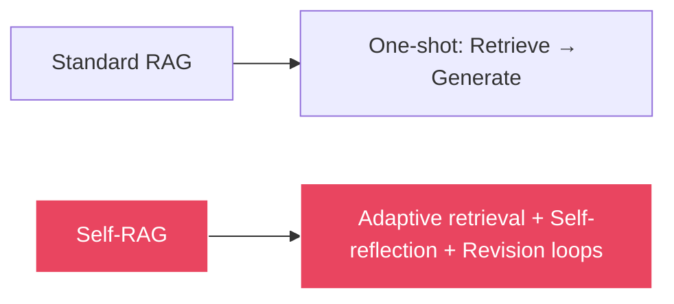
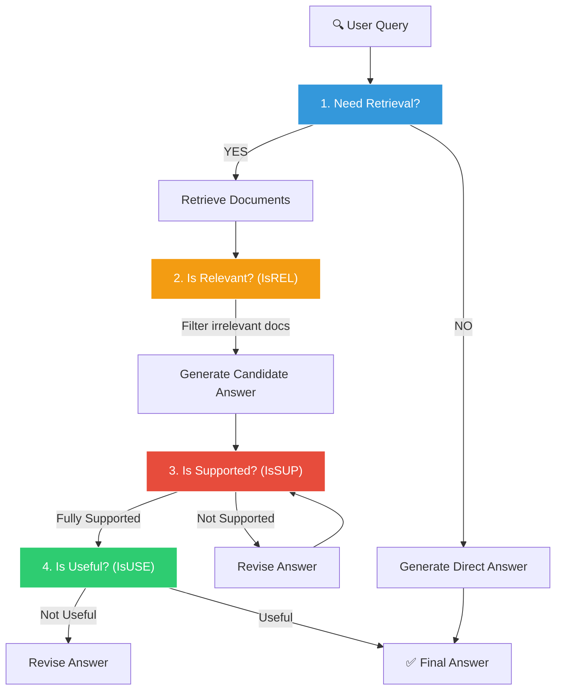
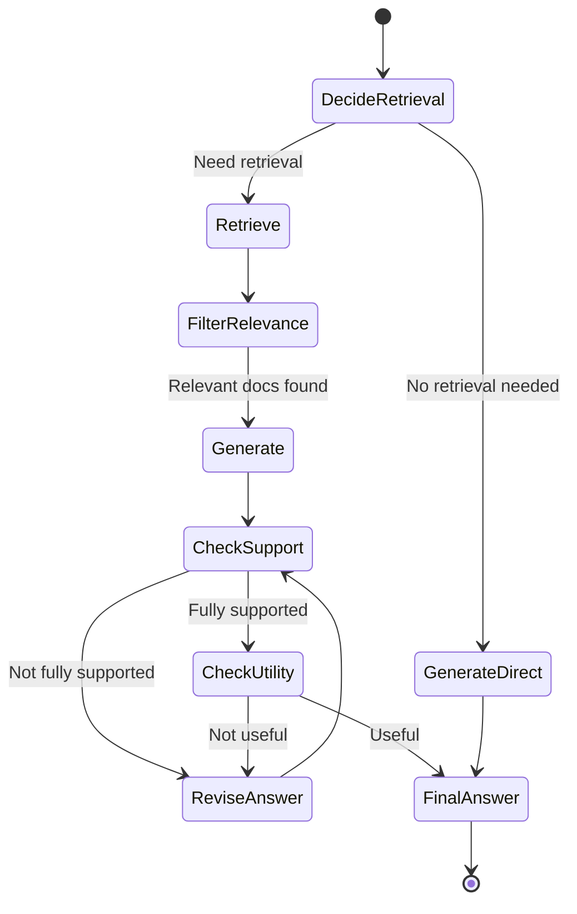

# 🤖 Self-RAG: Agentic Self-Reflective RAG

[← Previous: Corrective RAG](../09-corrective-rag/README.md) | [Back to Master README](../README.md) | [Next: Evaluation →](../11-evaluation/README.md)

---

## Table of Contents

- [Topic Overview](#topic-overview)
- [Why It Matters in RAG](#why-it-matters-in-rag)
- [Mental Model](#mental-model)
- [Core Theory: The 4 Self-Reflection Checkpoints](#core-theory-the-4-self-reflection-checkpoints)
- [How It Works: The Full State Graph](#how-it-works-the-full-state-graph)
- [Checkpoint 1: Need Retrieval? (Adaptive Retrieval)](#checkpoint-detail-adaptive-retrieval)
- [Checkpoint 2: Is Relevant? (IsREL)](#checkpoint-detail-isrel)
- [Checkpoint 3: Is Supported? (IsSUP)](#checkpoint-detail-issup)
- [Checkpoint 4: Is Useful? (IsUSE)](#checkpoint-detail-isuse)
- [Code Examples](#code-examples)
- [Why Strictness Matters: The Enterprise Danger](#why-strictness-matters-the-enterprise-danger)
- [Self-RAG vs CRAG](#self-rag-vs-crag)
- [Key Takeaways](#key-takeaways)
- [Checkpoint Questions](#checkpoint-questions)

---

## Topic Overview

**Self-RAG** is considered the pinnacle of production RAG architecture. Unlike standard RAG where the LLM is passive (given text and forced to answer), Self-RAG creates an **agent with self-criticism loops** that continuously evaluates its own actions through 4 reflection checkpoints.

---

## Why It Matters in RAG

Standard RAG is a **one-shot pipeline**: retrieve → generate → done. Self-RAG introduces **feedback loops** where the system:

1. Decides whether to retrieve at all
2. Filters irrelevant documents
3. Checks if its own answer is hallucinated
4. Verifies the answer actually addresses the user's question
5. **Revises its answer** if any check fails



---

## Mental Model

Think of Self-RAG as a **careful academic researcher**:

1. **Before searching:** "Do I even need to look this up, or can I answer from general knowledge?" (Adaptive Retrieval)
2. **After finding sources:** "Is this source actually relevant to my question?" (IsREL)
3. **After writing a draft answer:** "Is every claim in my draft backed by my sources? Did I add anything I can't cite?" (IsSUP)
4. **Final check:** "Does my answer actually address what was asked?" (IsUSE)
5. **If any check fails:** "Let me revise and try again." (Revision Loop)

---

## Core Theory: The 4 Self-Reflection Checkpoints



### Why These 4 Checks Are Revolutionary

| Checkpoint | What It Checks | What It Prevents |
|-----------|---------------|-----------------|
| **1. Need Retrieval?** | Does this query require database search? | Wasting time retrieving for "Hi, how are you?" |
| **2. IsREL** | Are retrieved docs relevant? | Feeding unrelated chunks to the LLM |
| **3. IsSUP** | Is every claim supported by context? | Hallucinations and unsupported statements |
| **4. IsUSE** | Does the answer address the question? | Off-topic or tangential responses |

---

## How It Works: The Full State Graph



---

## Checkpoint Detail: Adaptive Retrieval

```python
def decide_retrieval(state: State):
    """Decide if retrieval is needed for this query."""
    decision = should_retrieve_llm.invoke(
        f"Does this question require searching a knowledge base? "
        f"Question: {state['question']}"
    )
    return {"need_retrieval": decision.should_retrieve}

def route_after_decide(state: State):
    return "retrieve" if state["need_retrieval"] else "generate_direct"
```

**Example:**
- "What are the penalties under DPDP?" → **YES**, needs retrieval from legal docs
- "Hi, how are you?" → **NO**, answer directly without wasting a retrieval step

---

## Checkpoint Detail: IsREL

```python
def filter_relevant_docs(state: State):
    """Check each retrieved doc for relevance, drop irrelevant ones."""
    filtered = []
    for doc in state["retrieved_docs"]:
        decision = relevance_llm.invoke(
            f"Is this document relevant to: {state['question']}?\n"
            f"Document: {doc.page_content}"
        )
        if decision.is_relevant:
            filtered.append(doc)
    return {"relevant_docs": filtered}
```

---

## Checkpoint Detail: IsSUP

The hallucination detection checkpoint — the most critical of the four:

```python
from pydantic import BaseModel
from typing import Literal, List

class IsSUPDecision(BaseModel):
    issup: Literal["fully_supported", "partially_supported", "no_support"]
    evidence: List[str]  # Direct quotes from context that support claims

# If issup != "fully_supported" → route to revise_answer
```

### The Revision Loop

```python
def revise_answer(state: State):
    """Force the LLM to fix the answer using only direct quotes."""
    revised = revision_llm.invoke(
        f"Your previous answer contained unsupported claims. "
        f"Rewrite the answer using ONLY direct quotes from the context. "
        f"Context: {state['context']}\n"
        f"Question: {state['question']}\n"
        f"Previous answer: {state['answer']}"
    )
    return {"answer": revised}
```

---

## Checkpoint Detail: IsUSE

```python
class IsUSEDecision(BaseModel):
    isuse: Literal["useful", "not_useful"]
    reason: str  # Explanation of why the answer is/isn't useful
```

---

## Code Examples

### Full Self-RAG with Pydantic and LangGraph

```python
from pydantic import BaseModel
from typing import Literal, List

# Structured decision models
class RetrievalDecision(BaseModel):
    should_retrieve: bool

class IsRELDecision(BaseModel):
    is_relevant: bool

class IsSUPDecision(BaseModel):
    issup: Literal["fully_supported", "partially_supported", "no_support"]
    evidence: List[str]

class IsUSEDecision(BaseModel):
    isuse: Literal["useful", "not_useful"]
    reason: str
```

### LangGraph State Machine

```python
from langgraph.graph import StateGraph

workflow = StateGraph(State)

# Add nodes
workflow.add_node("decide_retrieval", decide_retrieval)
workflow.add_node("retrieve", retrieve_docs)
workflow.add_node("filter_relevance", filter_relevant_docs)
workflow.add_node("generate", generate_answer)
workflow.add_node("check_support", check_support)
workflow.add_node("check_utility", check_utility)
workflow.add_node("revise_answer", revise_answer)
workflow.add_node("generate_direct", generate_direct_answer)

# Add edges and conditional routing
workflow.add_conditional_edges("decide_retrieval", route_after_decide)
workflow.add_edge("retrieve", "filter_relevance")
workflow.add_edge("filter_relevance", "generate")
workflow.add_edge("generate", "check_support")
workflow.add_conditional_edges("check_support", route_after_support)
workflow.add_conditional_edges("check_utility", route_after_utility)
```

---

## Why Strictness Matters: The Enterprise Danger

Consider this scenario:

**HR Policy Document states:**
> "Employees receive 15 days of annual paid leave."

**RAG system responds:**
> "The company offers a **generous** leave policy of 15 days, reflecting its **employee-first culture**."

### What's Wrong?

The adjectives "generous" and "employee-first" are **dangerous hallucinations** in enterprise applications:

| Problem | Explanation |
|---------|------------|
| **Introduces bias** | Who decided 15 days is "generous"? That's subjective |
| **Unverified opinions** | "Employee-first culture" was never stated in the source |
| **Legal liability** | If cited in a lawsuit, this could be considered false company representation |
| **Compliance violation** | In regulated industries (legal, medical, banking), every word must be traceable to source |

### Why IsSUP Catches This

Self-RAG's IsSUP checkpoint demands **100% strict factual grounding**. If a word or conclusion cannot be traced directly back to a cited sentence in the source text, it is considered an **ungrounded hallucination** and must be revised.

The revised answer would be:
> "Employees receive 15 days of annual paid leave."

No adjectives. No opinions. Only verifiable facts.

---

## Self-RAG vs CRAG

| Feature | CRAG | Self-RAG |
|---------|------|---------|
| **Adaptive Retrieval** | ❌ Always retrieves | ✅ Decides if retrieval is needed |
| **Document Grading** | ✅ Scores documents | ✅ Filters by relevance (IsREL) |
| **Hallucination Check** | ❌ None | ✅ IsSUP with revision loop |
| **Answer Utility Check** | ❌ None | ✅ IsUSE verifies answer relevance |
| **Revision Loop** | ❌ One-shot | ✅ Iterates until supported & useful |
| **Web Search Fallback** | ✅ Yes | Depends on implementation |
| **Complexity** | Moderate | High |
| **Best For** | Reliable retrieval with fallback | Maximum answer quality and groundedness |

---

## Key Takeaways

1. **Self-RAG introduces 4 self-reflection checkpoints** — making the system an active agent, not a passive pipeline
2. **Adaptive Retrieval** prevents unnecessary database searches for simple queries
3. **IsREL filters** irrelevant documents before generation
4. **IsSUP is the hallucination detector** — it catches unsupported claims and forces revision
5. **IsUSE verifies** the answer actually addresses the user's question
6. **Enterprise strictness matters** — adjectives like "generous" are hallucinations when not in the source
7. **The revision loop** is what makes Self-RAG fundamentally different — it iterates until the answer is grounded and useful
8. **Self-RAG is the pinnacle** of production RAG architecture — trading computational cost for answer quality

---

## Checkpoint Questions

### Checkpoint 1: IsSUP Strictness

**Question:** Why does the IsSUP prompt strictly mark an answer as `partially_supported` or `no_support` even if the core facts are true, but the LLM added flattering qualitative adjectives like "generous leave policy" or "best-in-class culture" that weren't explicitly in the source document?

**Answer:** In enterprise applications (legal, HR, medical, banking), adjectives like "generous" and "employee-first" are **dangerous hallucinations**. They introduce bias, unverified opinions, and potential legal liability. If an employee takes the company to court, an AI claiming "best-in-class culture" can be cited as false company representation. Self-RAG demands 100% strict factual grounding — if a word cannot be traced back to the source text, it is an ungrounded hallucination that must be revised.

**Explanation:** The strictness of IsSUP exists because RAG systems are increasingly used in **regulated, high-stakes environments** where every generated word has real-world consequences. A medical RAG system that adds "this medication is highly effective" when the source only says "this medication treats condition X" could cause harm. The principle is: **generate only what the evidence supports — nothing more, nothing less.**

---

[← Previous: Corrective RAG](../09-corrective-rag/README.md) | [Back to Master README](../README.md) | [Next: Evaluation →](../11-evaluation/README.md)
