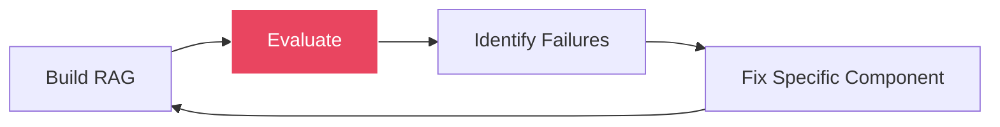
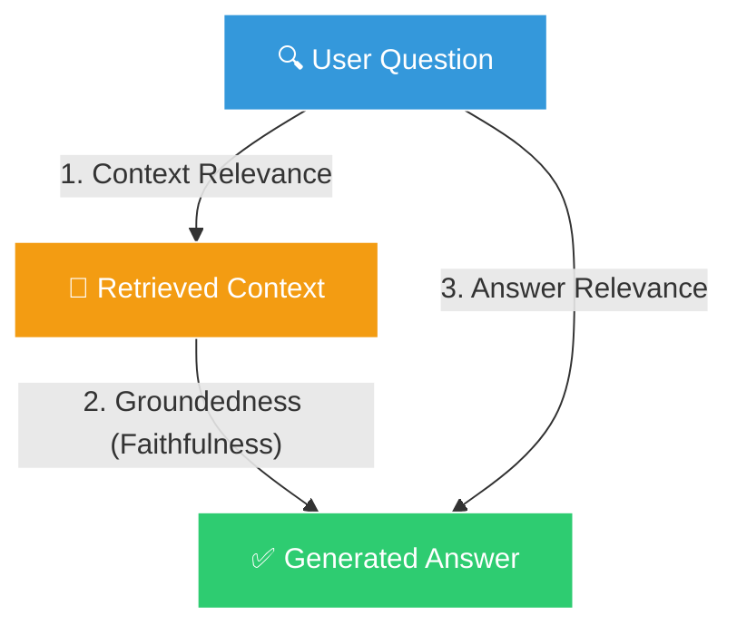
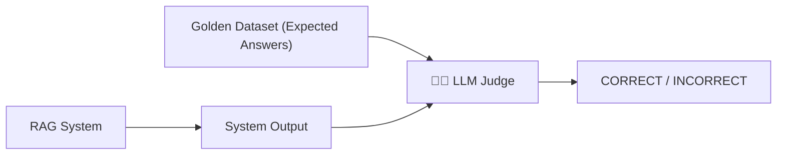

# 📊 RAG Evaluation: The RAG Triad & LLM-as-a-Judge

[← Previous: Self-RAG](../10-self-rag/README.md) | [Back to Master README](../README.md) | [Next: Revision & Interview →](../12-revision-and-interview/README.md)

---

## Table of Contents

- [Topic Overview](#topic-overview)
- [Why It Matters in RAG](#why-it-matters-in-rag)
- [Mental Model](#mental-model)
- [Core Theory: The RAG Triad](#core-theory-the-rag-triad)
- [The Three Metrics Explained](#the-three-metrics-explained)
- [LLM-as-a-Judge Pattern](#llm-as-a-judge-pattern)
- [Golden Dataset Creation](#golden-dataset-creation)
- [Observability: LangSmith Tracing](#observability-langsmith-tracing)
- [Diagnostic Scenarios](#diagnostic-scenarios)
- [Code Examples](#code-examples)
- [Common Mistakes](#common-mistakes)
- [Key Takeaways](#key-takeaways)
- [Checkpoint Questions](#checkpoint-questions)

---

## Topic Overview

**RAG Evaluation** is the science of measuring whether your RAG pipeline is working correctly. It goes beyond "vibe checking" a few questions — it provides automated, quantitative metrics that pinpoint *exactly which component* is failing and *why*.

---

## Why It Matters in RAG

You can't just test 2 or 3 questions manually and say "it looks good to me!" In production, you need:

- **Automated testing** — run hundreds of questions programmatically
- **Quantitative metrics** — numbers that tell you exactly what's broken
- **Component isolation** — is the retriever failing? The generator? Both?
- **Regression detection** — did your latest change make things better or worse?



---

## Mental Model

Think of the RAG Triad as a **medical diagnostic framework**:

- **Context Relevance** = "Did the nurse bring the right medical records?" (tests the retriever)
- **Groundedness** = "Did the doctor only use the medical records, or did they guess?" (tests for hallucination)
- **Answer Relevance** = "Did the doctor answer the patient's actual question?" (tests the generator)

Each metric isolates a different component, so you know exactly where to fix things.

---

## Core Theory: The RAG Triad

The RAG Triad is the industry-standard framework for diagnosing RAG pipeline failures:



Each edge of the triangle tests a different relationship:

| Metric | Tests | Component Evaluated | Question It Answers |
|--------|-------|-------------------|-------------------|
| **Context Relevance** | Question → Context | Retriever | Did we retrieve the right documents? |
| **Groundedness** | Context → Answer | Hallucination tendency | Is the answer supported by the context? |
| **Answer Relevance** | Question → Answer | Generator/Prompt | Did the answer address what was asked? |

---

## The Three Metrics Explained

### 1. Context Relevance (Evaluates the Retriever)

**Question:** Did the retriever pull chunks that actually contain the information needed to answer the question?

- **High score (0.9+):** The retriever found the right documents
- **Low score (< 0.5):** The retriever is pulling irrelevant noise — fix your embeddings, chunking, or add hybrid search

### 2. Groundedness / Faithfulness (Evaluates Hallucination)

**Question:** Is every claim in the generated answer directly supported by the retrieved context, or did the LLM make things up from its pretraining data?

- **High score (0.9+):** The LLM stuck to the evidence
- **Low score (< 0.5):** The LLM is hallucinating — strengthen your prompt constraints, add Self-RAG's IsSUP check

### 3. Answer Relevance (Evaluates the Generator)

**Question:** Did the generated answer actually address what the user asked, or did it go off on a tangent?

- **High score (0.9+):** The answer is on-target
- **Low score (< 0.5):** The LLM went off-topic — improve your prompt template, add few-shot examples

---

## LLM-as-a-Judge Pattern

**How do you score these metrics automatically?** Use a strong, deterministic LLM (like GPT-4o or Claude 3.5 Sonnet) prompted as an **impartial judge** to evaluate the outputs:



The judge LLM receives:
1. The original question
2. The expected (reference) answer
3. The system's predicted answer
4. Instructions to evaluate objectively

---

## Golden Dataset Creation

A **golden dataset** is a fixed test set of questions and expected reference answers:

```python
from langsmith import Client

client = Client()
dataset = client.create_dataset("RAG Evaluation Suite")

client.create_examples(
    dataset_id=dataset.id,
    examples=[
        {
            "inputs": {"question": "What is LangChain?"},
            "outputs": {"answer": "A framework for building LLM applications"}
        },
        {
            "inputs": {"question": "What are the penalties for data breach?"},
            "outputs": {"answer": "Penalties include fines up to Rs. 250 crore..."}
        },
        # ... more question-answer pairs
    ]
)
```

**Why a golden dataset?**
- Provides a **consistent benchmark** — same questions every time
- Enables **regression testing** — did your change improve or degrade quality?
- Removes subjectivity — no more "it looks okay to me"

---

## Observability: LangSmith Tracing

```python
import os
os.environ["LANGSMITH_TRACING"] = "true"
```

With tracing enabled, **every step** of your RAG pipeline is automatically logged:
- Chunks loaded
- Latency per step
- Token costs
- Prompts sent
- LLM responses
- Error traces

This creates an **observability dashboard** where you can trace errors down to the exact millisecond and pinpoint which component caused a failure.

---

## Diagnostic Scenarios

Understanding how to interpret RAG Triad scores is essential for debugging:

### Scenario 1: Everything Works

| Metric | Score |
|--------|-------|
| Context Relevance | 0.95 |
| Groundedness | 0.92 |
| Answer Relevance | 0.90 |

✅ All systems nominal. The retriever finds the right docs, the LLM stays grounded, and the answer is on-target.

---

### Scenario 2: Bad Retriever

| Metric | Score |
|--------|-------|
| Context Relevance | **0.25** |
| Groundedness | 0.88 |
| Answer Relevance | 0.30 |

🔍 **Diagnosis:** The retriever is broken. It's pulling irrelevant documents. The LLM is faithfully using the retrieved context (high groundedness), but since the context is wrong, the answer is also wrong.

**Fix:** Improve embeddings, chunking strategy, or add hybrid search.

---

### Scenario 3: High Retrieval, Low Answer Relevance

| Metric | Score |
|--------|-------|
| Context Relevance | 0.95 |
| Groundedness | 0.92 |
| Answer Relevance | **0.25** |

🎯 **Diagnosis:** The retriever was **flawless** — it pulled the exact right documents. The LLM did **not hallucinate** — every word was true and from the source. But the LLM **went off on a tangent** and failed to answer what the user actually asked.

**Example:**
- **Question:** "What is the refund policy for annual enterprise subscriptions?"
- **Retrieved context:** Billing terms containing refund rules, cancellation deadlines, payment methods
- **LLM Output:** "Enterprise subscriptions come with dedicated account managers, custom SSO integration, and quarterly business reviews."

The LLM summarized *other* features from the same context instead of answering the specific question about refunds.

**Fix:** Improve the system prompt with: "Pay strict attention to what is being asked. Do not summarize other features if they don't directly address the question." Add few-shot examples.

---

### Scenario 4: Hallucination Problem

| Metric | Score |
|--------|-------|
| Context Relevance | 0.90 |
| Groundedness | **0.20** |
| Answer Relevance | 0.85 |

🔮 **Diagnosis:** The retriever found good documents, and the answer is relevant to the question, but the LLM is **making things up** — adding facts from its pretraining data instead of sticking to the context.

**Fix:** Strengthen prompt constraints ("answer ONLY from the provided context"), lower temperature, or implement Self-RAG's IsSUP check.

---

## Code Examples

### LLM-as-a-Judge Evaluator

```python
def correctness(inputs: dict, outputs: dict, reference_outputs: dict) -> bool:
    """Judge if the RAG system's answer is correct."""
    user_content = f"""You are grading the following question:
    {inputs['question']}

    Here is the real answer:
    {reference_outputs['answer']}

    You are grading the following predicted answer:
    {outputs['response']}

    Respond with CORRECT or INCORRECT:
    """

    response = judge_llm.invoke(user_content)
    return response.content.strip() == "CORRECT"
```

### Running Evaluation with LangSmith

```python
from langsmith.evaluation import evaluate

results = evaluate(
    rag_pipeline,           # Your RAG function
    data="RAG Evaluation Suite",  # Golden dataset name
    evaluators=[correctness],      # Judge function(s)
    experiment_prefix="v1"
)
```

---

## Common Mistakes

1. **"Vibe checking" instead of measuring** — testing 3 questions manually is not evaluation
2. **Not creating a golden dataset** — without fixed benchmarks, you can't track progress
3. **Looking at only one metric** — a high answer relevance means nothing if groundedness is low
4. **Not tracing** — without observability, you can't diagnose what went wrong
5. **Using the same LLM as judge and generator** — the judge should ideally be a different, stronger model to avoid self-bias

---

## Key Takeaways

1. **The RAG Triad: Context Relevance + Groundedness + Answer Relevance** — the three metrics that diagnose any RAG failure
2. **Each metric tests a different component** — retriever, hallucination tendency, and generator
3. **LLM-as-a-Judge** automates evaluation using a strong LLM as an impartial scorer
4. **Golden datasets** provide consistent, reproducible benchmarks
5. **LangSmith tracing** gives millisecond-level observability into every pipeline step
6. **Score interpretation is key** — high retrieval + low answer relevance = prompt problem, not retriever problem
7. **Evaluation is not optional** — it's the only way to systematically improve a RAG pipeline

---

## Checkpoint Questions

### Checkpoint 1: Interpreting RAG Triad Scores

**Question:** Your RAG evaluation shows: Context Relevance = 0.95 (High), Groundedness = 0.92 (High), Answer Relevance = 0.25 (Very Low!). What is going wrong? Is the problem in your Vector Retriever or in your LLM Prompt/Generation?

**Answer:** The problem is **100% in the LLM Prompt / Generation**, not the retriever.

- **Context Relevance (0.95):** The retriever was flawless — it pulled the exact right documents
- **Groundedness (0.92):** The LLM did not hallucinate — every word was true and from the source
- **Answer Relevance (0.25):** The LLM went off on a tangent and failed to answer what the user asked

**Explanation:** This is a classic "off-topic generation" failure. The retriever did its job perfectly, and the LLM stayed faithful to the context. But the LLM summarized tangential information from the context instead of focusing on the specific question. The fix is in the **system prompt** — add instructions like "Pay strict attention to what is being asked. Do not summarize other features if they don't directly address the user's question." Adding few-shot examples of correct behavior also helps.

---

[← Previous: Self-RAG](../10-self-rag/README.md) | [Back to Master README](../README.md) | [Next: Revision & Interview →](../12-revision-and-interview/README.md)
