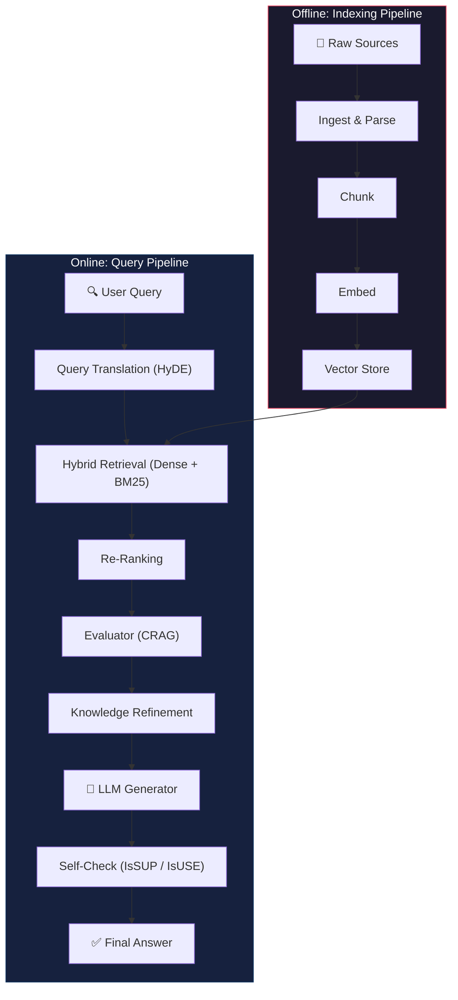
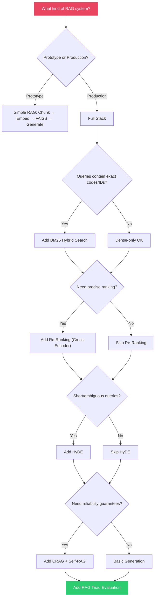

# 🎯 Revision & Interview Preparation

[← Previous: Evaluation](../11-evaluation/README.md) | [Back to Master README](../README.md)

---

## Table of Contents

- [The Complete RAG Stack](#the-complete-rag-stack)
- [Quick-Reference Cheat Sheet](#quick-reference-cheat-sheet)
- [RAG Pipeline Architecture](#rag-pipeline-architecture)
- [Decision Flowchart: Choosing Techniques](#decision-flowchart-choosing-techniques)
- [Common Interview Questions & Answers](#common-interview-questions--answers)
- [Technique Comparison Matrix](#technique-comparison-matrix)
- [Failure Mode Catalog](#failure-mode-catalog)
- [Key Formulas & Concepts](#key-formulas--concepts)
- [Rapid Revision Checklist](#rapid-revision-checklist)

---

## The Complete RAG Stack

```
                        THE COMPLETE RAG STACK
                        ══════════════════════
 1. Ingestion        ──► PyPDFLoader, WebBaseLoader, OCR
 2. Chunking         ──► Character, Recursive, Code-Aware AST (Language.PYTHON)
 3. Embeddings       ──► Dense Vectors, Cosine vs Dot Product, Normalization
 4. Vector Stores    ──► In-Memory FAISS vs Persistent ChromaDB
 5. Retrieval        ──► Core RAG loop: Retrieve → Augment → Generate
 6. Hybrid Search    ──► Dense (Semantics) + Sparse (BM25 Keywords) + RRF
 7. Re-Ranking       ──► Two-Stage Funnel: Recall (FAISS) → Precision (Cross-Encoder)
 8. Query Transform  ──► HyDE: Hypothetical Document Embeddings
 9. Corrective RAG   ──► Evaluate docs → Correct/Incorrect/Ambiguous → Web fallback
10. Self-RAG         ──► Agentic reflection: IsREL → IsSUP → IsUSE + revision loops
11. Evaluation       ──► RAG Triad + LLM-as-a-Judge + LangSmith Tracing
```

---

## Quick-Reference Cheat Sheet

| Topic | One-Line Summary | Key Insight |
|-------|-----------------|-------------|
| **Data Ingestion** | Convert diverse formats into Document(page_content, metadata) | Garbage in = garbage out; scanned PDFs need OCR |
| **Chunking** | Split text into retrievable units | Too small = lost context; too large = diluted signal |
| **Embeddings** | Convert text into dense vectors for similarity search | Always normalize; use same model for index + query |
| **Vector Stores** | Store and search vectors efficiently | FAISS = speed engine; ChromaDB = complete database with metadata |
| **Retrieval** | Find top-k similar chunks to a query | k is a count, not a quality filter; add score thresholds |
| **Hybrid Search** | Combine dense (semantic) + sparse (keyword) | Dense fails on error codes; sparse fails on synonyms; hybrid handles both |
| **Re-Ranking** | Re-order candidates with a precise model | Bi-Encoder = fast/coarse; Cross-Encoder = slow/precise; use both |
| **HyDE** | Search with hypothetical answers, not questions | Fixes asymmetric search; but LLM hallucination poisons results |
| **CRAG** | Evaluate retrieval quality before generating | Three paths: Correct → Refine, Incorrect → Web Search, Ambiguous → Merge |
| **Self-RAG** | 4 self-reflection checkpoints + revision loops | Adaptive retrieval, IsREL, IsSUP (hallucination), IsUSE (utility) |
| **Evaluation** | RAG Triad: Context Relevance, Groundedness, Answer Relevance | Each metric isolates a different failing component |

---

## RAG Pipeline Architecture



---

## Decision Flowchart: Choosing Techniques



---

## Common Interview Questions & Answers

### Q1: What is RAG and why is it needed?

**Answer:** RAG (Retrieval-Augmented Generation) enhances LLM responses by first retrieving relevant information from an external knowledge base, then augmenting the LLM's prompt with that context before generating an answer. It's needed because LLMs are limited by their training data cutoff, lack access to private data, and tend to hallucinate. RAG grounds generation in retrieved evidence.

---

### Q2: Explain the difference between dense and sparse retrieval.

**Answer:** Dense retrieval (embeddings) encodes semantic meaning into continuous vectors — excellent for synonyms and paraphrasing but poor with exact keywords/codes. Sparse retrieval (BM25) counts exact keyword matches with term-frequency weighting — excellent for specific identifiers but has zero semantic understanding. Production systems use hybrid search (both together) via Ensemble Retriever with weighted fusion.

---

### Q3: What is the "Lost in the Middle" problem?

**Answer:** Research shows LLMs pay strongest attention to the beginning and end of the context window, but tend to ignore information in the middle. This means if you retrieve 20 chunks, the answer buried in chunk #10 may be ignored. The fix: keep k small (3–5) and use re-ranking to ensure the most relevant chunk is positioned first.

---

### Q4: How does re-ranking improve retrieval quality?

**Answer:** Re-ranking uses a two-stage funnel. Stage 1 (Bi-Encoder / FAISS) retrieves a broad candidate pool (k=20) optimizing for recall. Stage 2 (Cross-Encoder / LLM) re-scores only those candidates by processing query + document together through attention, optimizing for precision. You can't run the Cross-Encoder over 1M docs (too slow), and you can't skip Stage 1 (you'd miss relevant docs).

---

### Q5: What is HyDE and when would you NOT use it?

**Answer:** HyDE (Hypothetical Document Embeddings) generates a hypothetical answer using an LLM, then searches with that answer's embedding instead of the question's embedding. This solves the query-document asymmetry problem. **Don't use it** for queries about proprietary internal tools the LLM has never seen — it will hallucinate a wrong hypothetical, poisoning the search vector and returning irrelevant results.

---

### Q6: Explain the CRAG architecture.

**Answer:** CRAG (Corrective RAG) adds an evaluator between retrieval and generation. It scores each retrieved document (0.0–1.0) and routes to three paths: CORRECT (score > 0.7) → refine by filtering sentences; INCORRECT (all < 0.3) → discard and web search; AMBIGUOUS (0.3–0.7) → merge internal + web results. It also performs knowledge refinement — decomposing chunks into sentences and keeping only relevant ones.

---

### Q7: What are the 4 checkpoints in Self-RAG?

**Answer:**
1. **Need Retrieval?** — Skip retrieval for simple queries ("Hi, how are you?")
2. **IsREL** — Filter out irrelevant retrieved documents
3. **IsSUP** — Check if every claim is supported by context (hallucination detection). If not → revise answer
4. **IsUSE** — Verify the answer addresses the user's question. If not → revise answer

---

### Q8: How do you evaluate a RAG pipeline?

**Answer:** Use the RAG Triad: (1) **Context Relevance** — did we retrieve the right docs? (tests retriever), (2) **Groundedness** — is the answer supported by context? (tests hallucination), (3) **Answer Relevance** — did we answer what was asked? (tests generator). Score these using the LLM-as-a-Judge pattern with a golden dataset. Trace with LangSmith for millisecond-level observability.

---

### Q9: Context Relevance = 0.95, Groundedness = 0.92, Answer Relevance = 0.25. What's broken?

**Answer:** The **LLM prompt/generation** is the problem. The retriever found perfect documents (0.95), the LLM didn't hallucinate (0.92), but it went off-topic and didn't answer the actual question (0.25). Fix: improve the system prompt with "answer ONLY the specific question asked, don't summarize unrelated context."

---

### Q10: FAISS vs ChromaDB — when to use which?

**Answer:** **FAISS** = low-level vector indexing library. Stores only raw vectors, no metadata. Ultra-fast, GPU support, best for millions/billions of vectors or when you already have a separate metadata store. **ChromaDB** = complete vector database. Stores vectors + text + metadata + IDs. Native metadata filtering, CRUD operations, auto-persistence. Best for RAG prototypes and multi-tenant applications requiring filtered search.

---

## Technique Comparison Matrix

| Technique | What It Solves | Trade-off | When to Use |
|-----------|---------------|-----------|-------------|
| **Recursive Chunking** | Preserves text structure | May not respect code syntax | General text documents |
| **Language-Aware Chunking** | Preserves code syntax | Language-specific | Source code indexing |
| **Hybrid Search** | Exact keywords + semantics | Two retrievers to maintain | Queries with codes/IDs |
| **Re-Ranking** | Precise relevance ordering | Extra latency + cost | When top-k quality matters |
| **HyDE** | Query-document asymmetry | Hallucination risk | General knowledge queries |
| **CRAG** | Bad retrieval quality | More LLM calls | When KB coverage is uncertain |
| **Self-RAG** | Hallucination + off-topic | Highest latency + cost | High-stakes enterprise apps |
| **Score Threshold** | Irrelevant results | May over-filter | All production systems |

---

## Failure Mode Catalog

| Failure | Symptom | Root Cause | Fix |
|---------|---------|-----------|-----|
| Empty chunks from scanned PDF | LLM says "I don't know" | PyPDFLoader can't read image text | Use OCR (unstructured, pdfminer) |
| Broken code in retrieved chunks | LLM generates syntax errors | Generic splitter cuts code mid-statement | Use `from_language(Language.PYTHON)` |
| Long chunks outscore relevant ones | Wrong docs ranked first | Vector magnitudes not normalized | `normalize_embeddings=True` |
| Error code not found | "No results" for exact identifiers | Dense retrieval blurs unique tokens | Add BM25 hybrid search |
| Hallucinated adjectives | "Generous policy" not in source | LLM adds unsupported qualifiers | IsSUP check in Self-RAG |
| Off-topic answers | Correct facts, wrong question answered | Weak prompt template | Add "answer ONLY the specific question" |
| HyDE poisoned search | Completely irrelevant results | LLM hallucinated hypothetical for niche topic | Fall back to standard retrieval |

---

## Key Formulas & Concepts

### Sliding Window (Chunking)

$$\text{Step Size} = \text{chunk\_size} - \text{chunk\_overlap}$$

### Cosine Similarity (Embeddings)

$$\text{Cosine Similarity} = \frac{\mathbf{A} \cdot \mathbf{B}}{|\mathbf{A}| \cdot |\mathbf{B}|}$$

When normalized ($|\mathbf{A}| = |\mathbf{B}| = 1$): $\text{Cosine} = \mathbf{A} \cdot \mathbf{B}$ (just the dot product)

### Reciprocal Rank Fusion (Hybrid Search)

$$\text{RRF}(d) = \sum_{r \in \text{retrievers}} \frac{1}{k + \text{rank}_r(d)}$$

### CRAG Thresholds

| Range | Verdict | Action |
|-------|---------|--------|
| Score > 0.7 | CORRECT | Refine sentences → Generate |
| Score < 0.3 | INCORRECT | Discard → Web Search |
| 0.3 ≤ Score ≤ 0.7 | AMBIGUOUS | Merge internal + web |

---

## Rapid Revision Checklist

Use this for quick revision before interviews or when returning to the material:

- [ ] Can I explain what RAG is in one sentence?
- [ ] Can I draw the basic RAG pipeline (Ingest → Chunk → Embed → Store → Retrieve → Generate)?
- [ ] Do I understand why scanned PDFs break PyPDFLoader?
- [ ] Can I explain the 4 chunking paradigms and when to use each?
- [ ] Do I know why normalization matters for embeddings?
- [ ] Can I compare FAISS vs ChromaDB with 3+ differentiators?
- [ ] Do I understand why k=3 always returns 3 results, even for irrelevant queries?
- [ ] Can I explain why dense search fails on error codes and BM25 fails on synonyms?
- [ ] Can I draw the two-stage re-ranking funnel?
- [ ] Can I explain the asymmetric search problem and how HyDE solves it?
- [ ] Can I explain CRAG's three verdict paths?
- [ ] Can I list Self-RAG's 4 checkpoints and what each prevents?
- [ ] Can I explain why "generous leave policy" is a hallucination when the source only says "15 days"?
- [ ] Can I diagnose which component is failing given RAG Triad scores?
- [ ] Can I explain LLM-as-a-Judge and golden datasets?

---

[← Previous: Evaluation](../11-evaluation/README.md) | [Back to Master README](../README.md)
