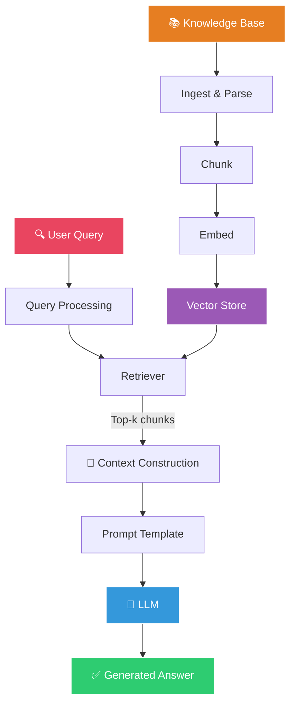
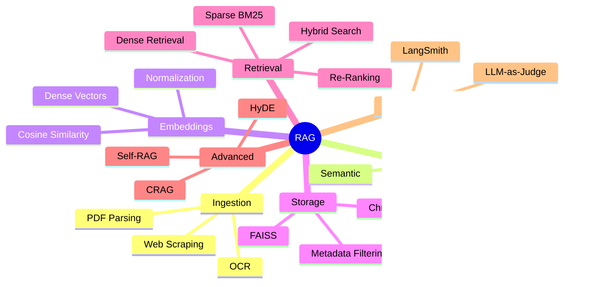
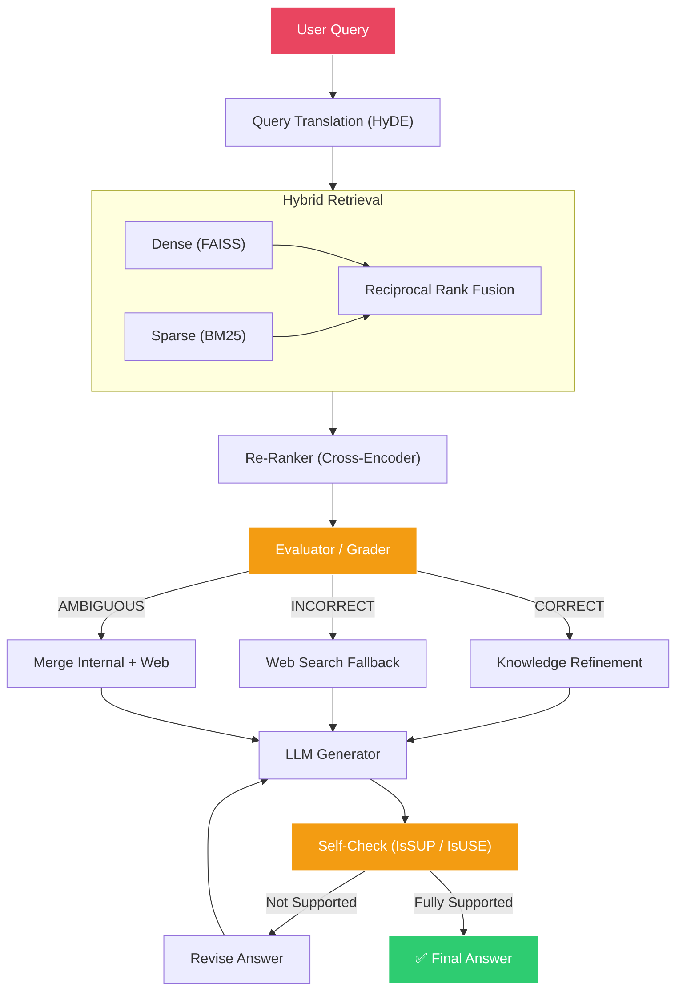

# 🧠 Mastery in RAG

> **A comprehensive, interactive knowledge base for mastering Retrieval-Augmented Generation — from first principles to production-grade agentic architectures.**

---

## What Is This Repository?

This repository is a structured, self-contained learning path for **RAG (Retrieval-Augmented Generation)** — the dominant paradigm for building LLM applications that can reason over private, domain-specific data.

It is designed for:

- 📖 **Progressive learning** — follow the numbered folders sequentially
- 🔄 **Quick revision** — each topic has key takeaways and checkpoint Q&A
- 🏗️ **Practical implementation** — real code examples at every stage
- 🎯 **Interview preparation** — consolidated cheat sheet in the final section
- 🧭 **Architecture decisions** — comparison tables and trade-off analysis throughout

---

## What Is RAG?

**Retrieval-Augmented Generation** is an architecture pattern that enhances LLM responses by first *retrieving* relevant information from an external knowledge base, then *augmenting* the LLM's prompt with that context before *generating* an answer.

```
User Question
     ↓
[ Retrieve relevant documents from a knowledge base ]
     ↓
[ Augment the LLM prompt with retrieved context ]
     ↓
[ Generate a grounded, accurate answer ]
```

**Why RAG matters:** LLMs are powerful but limited by their training data cutoff, lack of access to private/proprietary information, and tendency to hallucinate. RAG solves all three problems by grounding generation in retrieved evidence.

---

## Learning Philosophy

This repository follows a progressive mastery flow:

```
Ingest → Chunk → Embed → Store → Retrieve → Rank → Transform → Correct → Reflect → Evaluate
```

Each stage builds on the previous one. By the end, you'll understand not just *how* each component works, but *why* it exists and *when* to use it.

---

## Learning Roadmap


---

## Repository Structure

| Folder | Topic | What You'll Learn |
|--------|-------|-------------------|
| [`01-data-ingestion`](./01-data-ingestion/README.md) | Data Ingestion & Parsing | Loading PDFs, web pages; Document format; OCR challenges |
| [`02-chunking`](./02-chunking/README.md) | Chunking Strategies | Fixed, Recursive, Semantic, Language-Aware splitting; overlap mechanics |
| [`03-embeddings`](./03-embeddings/README.md) | Embeddings & Vector Spaces | Dense vectors, model comparison, normalization, FAISS indexing |
| [`04-vector-stores`](./04-vector-stores/README.md) | Vector Databases | FAISS vs ChromaDB; metadata filtering; persistence |
| [`05-retrieval-and-generation`](./05-retrieval-and-generation/README.md) | Core RAG Loop | Query → Retrieve → Prompt → Generate; top-k; score thresholds |
| [`06-hybrid-search`](./06-hybrid-search/README.md) | Hybrid Search | Dense + Sparse (BM25); Ensemble Retriever; Reciprocal Rank Fusion |
| [`07-reranking`](./07-reranking/README.md) | Re-Ranking | Two-stage funnel; Bi-Encoder vs Cross-Encoder; LLM re-ranking |
| [`08-query-translation`](./08-query-translation/README.md) | HyDE (Query Translation) | Asymmetric search problem; hypothetical document embeddings |
| [`09-corrective-rag`](./09-corrective-rag/README.md) | Corrective RAG (CRAG) | Self-correcting retrieval; confidence thresholds; web search fallback |
| [`10-self-rag`](./10-self-rag/README.md) | Self-RAG | 4 reflection checkpoints; hallucination detection; revision loops |
| [`11-evaluation`](./11-evaluation/README.md) | RAG Evaluation | RAG Triad; LLM-as-a-Judge; LangSmith tracing |
| [`12-revision-and-interview`](./12-revision-and-interview/README.md) | Revision & Interview Prep | Complete cheat sheet; common questions; architecture decisions |

---

## Prerequisites

Before diving in, you should be comfortable with:

- **Python** — basic scripting, virtual environments, pip
- **LLMs** — general understanding of what large language models are and how they generate text
- **APIs** — making API calls, environment variables, `.env` files
- **Command Line** — navigating directories, running scripts

Helpful but not required:

- Familiarity with LangChain / LangGraph
- Basic understanding of machine learning concepts (vectors, similarity)

---

## How to Use This Repository

### 🎓 Sequential Learning (Recommended for First Pass)
Follow folders `01` through `11` in order. Each builds on the previous.

### 🔄 Quick Revision
Jump to any topic's **Key Takeaways** section for a rapid refresher.

### 🔍 Concept Lookup
Use the table above or the Quick Navigation section below to find specific topics.

### 🎯 Interview Preparation
Go directly to [`12-revision-and-interview`](./12-revision-and-interview/README.md) for a consolidated cheat sheet.

### 🏗️ Practical Implementation
Each folder contains code examples. Follow the code blocks and checkpoint exercises.

### 🏛️ Architecture Revision
Look for comparison tables and Mermaid diagrams throughout. The re-ranking, CRAG, and Self-RAG sections are particularly architecture-heavy.

---

## Core RAG Mental Model

At its heart, every RAG system answers one question:

> *"Given what I know (retrieved context), how should I respond to this question?"*



**The two phases:**
1. **Offline (Indexing):** Ingest → Chunk → Embed → Store in Vector DB
2. **Online (Query):** Encode query → Search → Retrieve → Augment prompt → Generate

---

## Key Concepts Map



---

## RAG Architecture (Production Grade)



---

## Revision Strategy

1. **First pass:** Read each folder sequentially, attempt checkpoint questions before reading answers
2. **After 3 days:** Re-read Key Takeaways sections only; attempt checkpoints from memory
3. **After 1 week:** Go through the [Revision & Interview](./12-revision-and-interview/README.md) cheat sheet
4. **Before interviews:** Focus on comparison tables, architecture diagrams, and failure modes
5. **Ongoing:** When building RAG systems, return to specific folders for implementation guidance

---

## Checkpoints

Every topic folder contains **Checkpoint Questions** embedded after the concepts they test. Each checkpoint includes:

- ❓ **Question** — tests your understanding
- ✅ **Answer** — the correct response
- 💡 **Explanation** — why the answer is correct and what the deeper insight is

Attempt the question *before* reading the answer for maximum learning retention.

---

## Progress Tracker

Use this checklist to track your journey:

- [ ] Data Ingestion & Parsing
- [ ] Chunking Strategies
- [ ] Embeddings & Vector Spaces
- [ ] Vector Stores (FAISS vs ChromaDB)
- [ ] Retrieval & Generation (Core RAG Loop)
- [ ] Hybrid Search (Dense + Sparse)
- [ ] Re-Ranking (Two-Stage Funnel)
- [ ] Query Translation (HyDE)
- [ ] Corrective RAG (CRAG)
- [ ] Self-RAG (Agentic Reflection)
- [ ] RAG Evaluation (RAG Triad)
- [ ] Revision & Interview Preparation

---

## Quick Navigation

| # | Topic | Link |
|---|-------|------|
| 01 | Data Ingestion & Parsing | [→ Go](./01-data-ingestion/README.md) |
| 02 | Chunking Strategies | [→ Go](./02-chunking/README.md) |
| 03 | Embeddings & Vector Spaces | [→ Go](./03-embeddings/README.md) |
| 04 | Vector Stores | [→ Go](./04-vector-stores/README.md) |
| 05 | Retrieval & Generation | [→ Go](./05-retrieval-and-generation/README.md) |
| 06 | Hybrid Search | [→ Go](./06-hybrid-search/README.md) |
| 07 | Re-Ranking | [→ Go](./07-reranking/README.md) |
| 08 | Query Translation (HyDE) | [→ Go](./08-query-translation/README.md) |
| 09 | Corrective RAG | [→ Go](./09-corrective-rag/README.md) |
| 10 | Self-RAG | [→ Go](./10-self-rag/README.md) |
| 11 | Evaluation | [→ Go](./11-evaluation/README.md) |
| 12 | Revision & Interview | [→ Go](./12-revision-and-interview/README.md) |

---

<p align="center">
  <i>Built from structured learning — optimized for understanding, revision, and mastery.</i>
</p>
